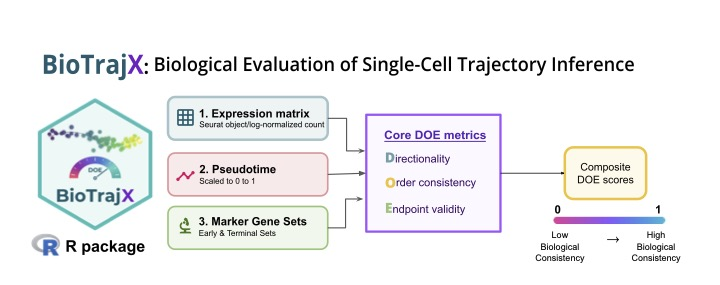
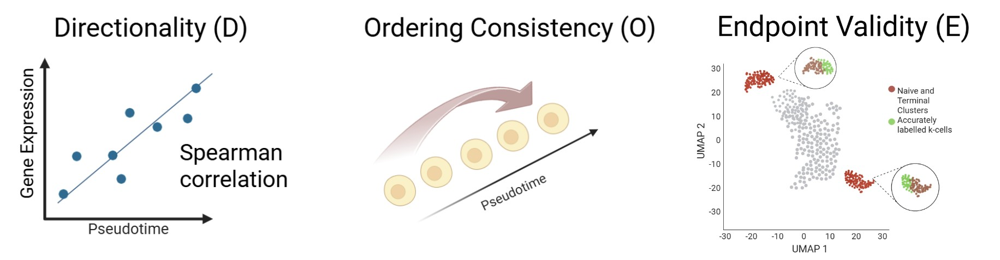
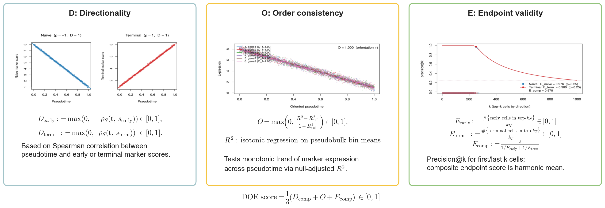
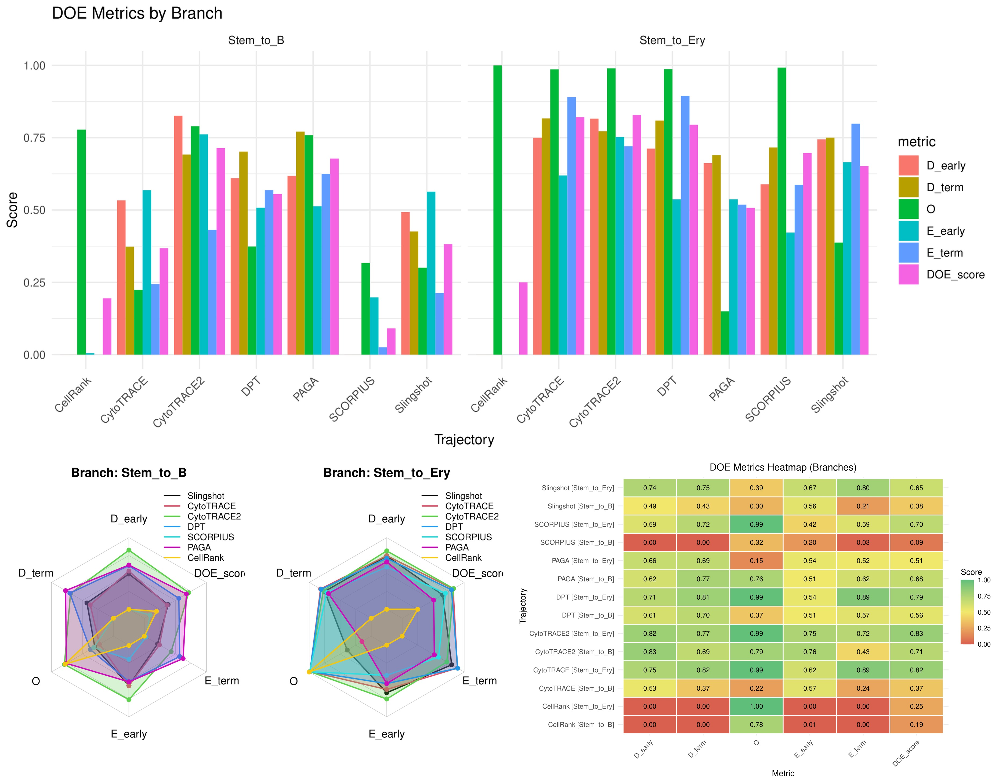

# BioTrajX

BioTrajX provides Directionality, Order and Endpoint (DOE) metrics for
benchmarking single-cell pseudotime ordeing . The package includes wrappers
for linear and branched trajectories along with visualization helpers for
summaries across competing trajectory inference methods.

## Installation

Install the development version directly from GitHub with:

```r
# install.packages("remotes")
remotes::install_github("irislity/BioTrajX")
```

## Getting started



```r
library(BioTrajX)

# compute DOE metrics for a single trajectory
result <- compute_single_doe_linear(expr, pseudotime, early_markers, terminal_markers)

# compare multiple trajectories
comparison <- compute_multi_doe_linear(expr, pseudotime_list, early_markers, terminal_markers)
plot(comparison, type = "bar")

# branched trajectories
branched <- compute_multi_doe_branched(expr, branched_pseudotime, early_markers_list, terminal_markers_list)
plot(branched, scope = "overall", type = "heatmap") 

```
## DOE metrics




## Outputs
```r

plot(branched, type = "bar", branch_mode = "facet")
plot(branched, type = "radar", branch_mode = "separate")
plot(branched, type = "heatmap", branch_mode = "stack")

```


## Tutorials

- [Evaluating pseudotime methods with BioTrajX (linear datasets)](vignettes/linear-trajectory.md) —
  walks through a real CD8+ T cell exhaustion dataset, including how to use
  the DOE score to sanity-check a root cell choice.
- [Evaluating branched pseudotime trajectories with BioTrajX](vignettes/branched-trajectory.md) —
  a branched stem cell differentiation dataset, scored per lineage.
- [Validating BioTrajX against ground truth](vignettes/ground-truth-validation.md) —
  checks whether the (label-free) DOE score actually predicts recovery of a
  known ground truth (true day of infection) across methods.

All three are also available as a rendered HTML site at
[irislity.github.io/BioTrajX](https://irislity.github.io/BioTrajX/articles/).


