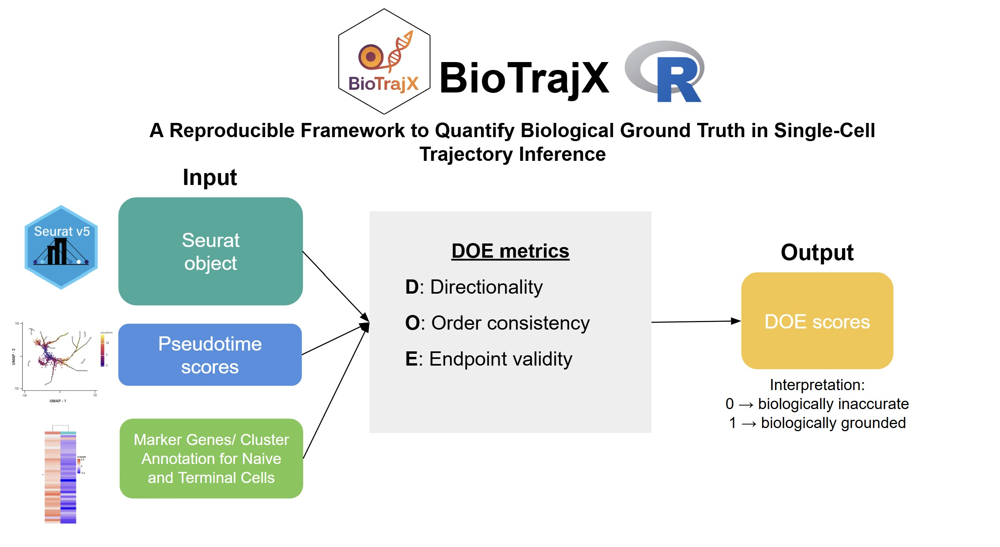
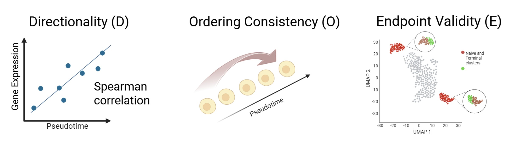
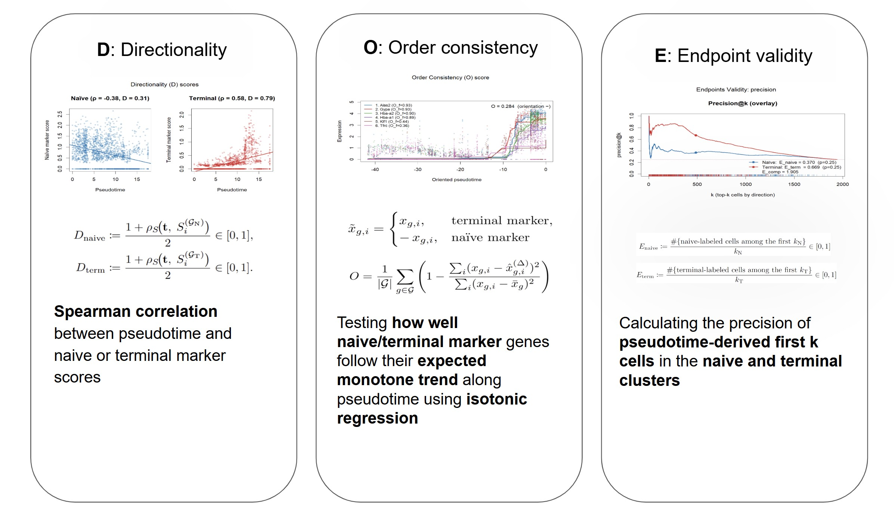

# BioTrajX

BioTrajX provides Directionality, Order and Endpoint (DOE) metrics for
benchmarking single-cell pseudotime trajectories. The package includes wrappers
for linear and branched trajectories along with visualization helpers for
summaries across competing trajectory inference methods.

## Installation

Install the development version directly from GitHub with:

```r
# install.packages("remotes")
remotes::install_github("irislity/BioTrajX")
```

## Getting started



```r
library(BioTrajX)

# compute DOE metrics for a single trajectory
result <- compute_single_DOE_linear(expr, pseudotime, naive_markers, terminal_markers)

# compare multiple trajectories
comparison <- compute_multi_DOE_linear(expr, pseudotime_list, naive_markers, terminal_markers)
plot(comparison, type = "bar")

# branched trajectories
branched <- compute_multi_DOE_branched(expr, branched_pseudotime, naive_markers_list, terminal_markers_list)
plot(branched, scope = "overall", type = "heatmap") 

```
## DOE metrics




## Outputs
```r

plot.multi_doe_branched(results, type = "bar", branch_mode = "facet")
plot.multi_doe_branched(results, type = "radar", branch_mode = "separate")
plot.multi_doe_branched(results, type = "heatmap", branch_mode = "stack")

```


## Updates
🚧 Beta release and accompanying preprint planned for **February 2026**.


