```{r setup, include = FALSE}
knitr::opts_chunk$set(
  collapse = TRUE,
  comment = "#>",
  fig.width = 8,
  fig.height = 5,
  warning = FALSE,
  message = FALSE,
  eval = FALSE   # requires downloaded data — run interactively after loading stem_cell.rds
)
```

This article walks through applying BioTrajX's DOE metrics to a branched stem cell
differentiation dataset. Because the trajectory splits into two lineages (Stem →
Erythroid and Stem → B cell), BioTrajX requires **per-branch** marker sets and
cell filters — handled by `compute_multi_doe_branched()`.

## Supported trajectory inference methods

BioTrajX evaluates pseudotime from any TI method. The eight methods tested in
this package are listed below. You are not required to run all of them — pass
whichever pseudotime vectors you have to `compute_multi_doe_branched()`.

| Method | Type | Language | Notes |
|---|---|---|---|
| Slingshot | MST + principal curves | R | Recommended; handles branching well |
| CytoTRACE | Gene count structure | R | No root cell needed |
| Monocle3 | Graph-based learning | R | Requires a root cell |
| DPT | Diffusion pseudotime | R | Requires a root cell |
| SCORPIUS | Dimensionality reduction | R | Designed for linear trajectories |
| TSCAN | MST on cluster centers | R | Only assigns pseudotime to cells on the main path |
| PAGA-DPT | Graph abstraction + DPT | Python | Requires `scanpy` conda env |
| Palantir | Markov-chain fate probabilities | Python | Requires `palantir` conda env |

To run all methods at once, source `manuscript/scripts/real/run_ti_methods.R`,
call `run_all_ti_methods()`, and add the results to your Seurat object:

```{r run-ti, eval = FALSE}
source("manuscript/scripts/real/run_ti_methods.R")

# Identify a root cell (lowest pseudotime among Stem_Progenitors)
stem_cells <- which(stem_cell$Phenotype == "Stem_Progenitors")
start_cell <- names(which.min(stem_cell$Slingshot[stem_cells]))

expr       <- as.matrix(GetAssayData(stem_cell, layer = "data"))
ti_results <- run_all_ti_methods(expr, start_cell = start_cell)

# Add all pseudotime vectors as metadata columns
stem_cell <- AddMetaData(stem_cell, ti_results)
```

> **Prerequisite:** pseudotime values must already be computed and stored as
> metadata columns in your Seurat object before running this vignette. See the
> note in Step 2 for the expected column names.

## 1. Load the stem cell dataset

Download the Seurat object manually from the following link:

**https://transfer.it/t/6TjpTRshQZDT**

Then load it into R:

```{r load-data}
library(BioTrajX)
library(Seurat)

stem_cell <- readRDS("data/stem_cell.rds")
```

## 2. Check pre-computed pseudotimes

This vignette assumes you have already run your trajectory inference methods and
stored the resulting pseudotime vectors as Seurat metadata columns. The expected
columns (added by `run_all_ti_methods()` + `AddMetaData()`) are:

| Column | Method | Language |
|---|---|---|
| `Slingshot` | MST + principal curves | R |
| `CytoTRACE` | Gene count structure | R |
| `Monocle3` | Graph-based learning | R |
| `DPT` | Diffusion pseudotime | R |
| `SCORPIUS` | Dimensionality reduction | R |
| `TSCAN` | MST on cluster centers | R |
| `PAGA-DPT` | Graph abstraction + DPT | Python |
| `Palantir` | Markov-chain fate probabilities | Python |

Verify they are present before continuing:

```{r check-pseudotimes}
required_cols <- c("Slingshot", "CytoTRACE", "Monocle3",
                   "DPT", "SCORPIUS", "TSCAN", "PAGA-DPT", "Palantir")
missing <- setdiff(required_cols, colnames(stem_cell@meta.data))
if (length(missing) > 0) {
  stop("Missing pseudotime columns: ", paste(missing, collapse = ", "),
       "\nPlease run your TI methods and add results to the Seurat object first.")
}
```

You can visually inspect them alongside cluster annotations:

```{r visualize}
DimPlot(stem_cell, group.by = "Phenotype")
FeaturePlot(stem_cell, features = "Monocle3")
FeaturePlot(stem_cell, features = "Slingshot")
FeaturePlot(stem_cell, features = "CytoTRACE")
```

```{r umap-plots, echo = FALSE, eval = TRUE, out.width = "100%"}
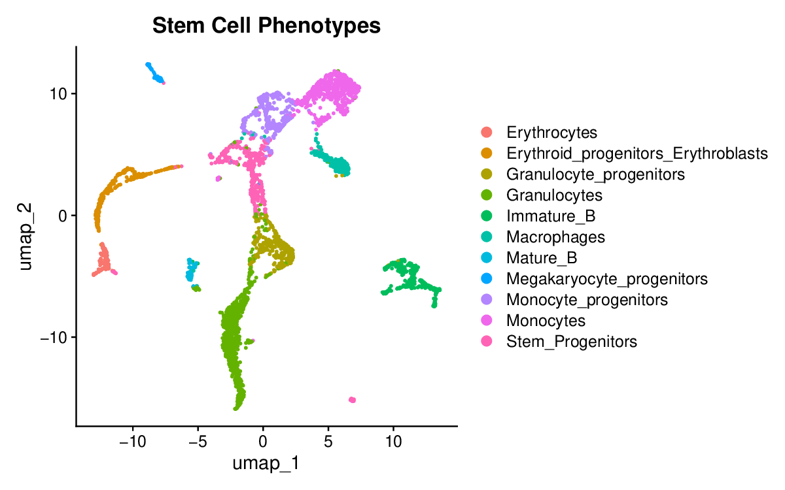
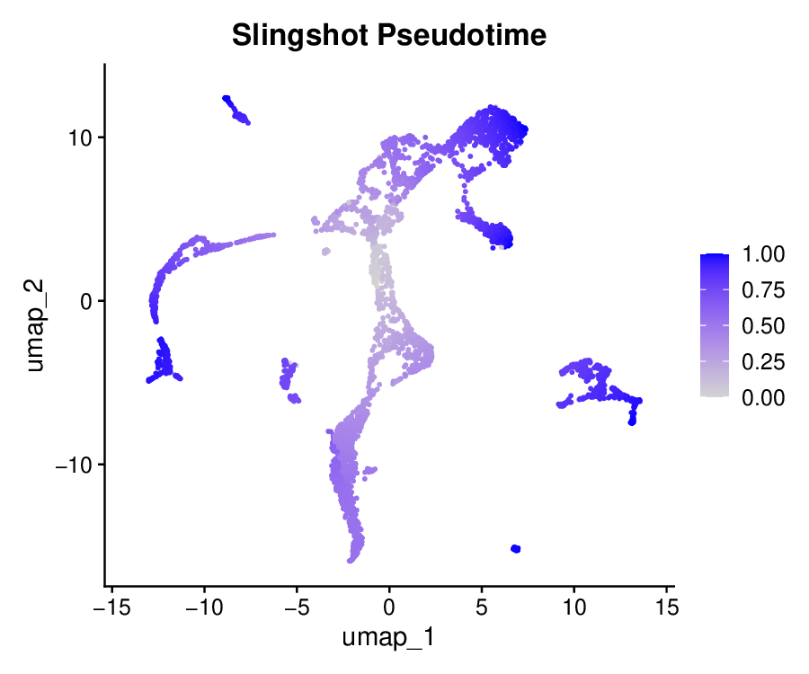
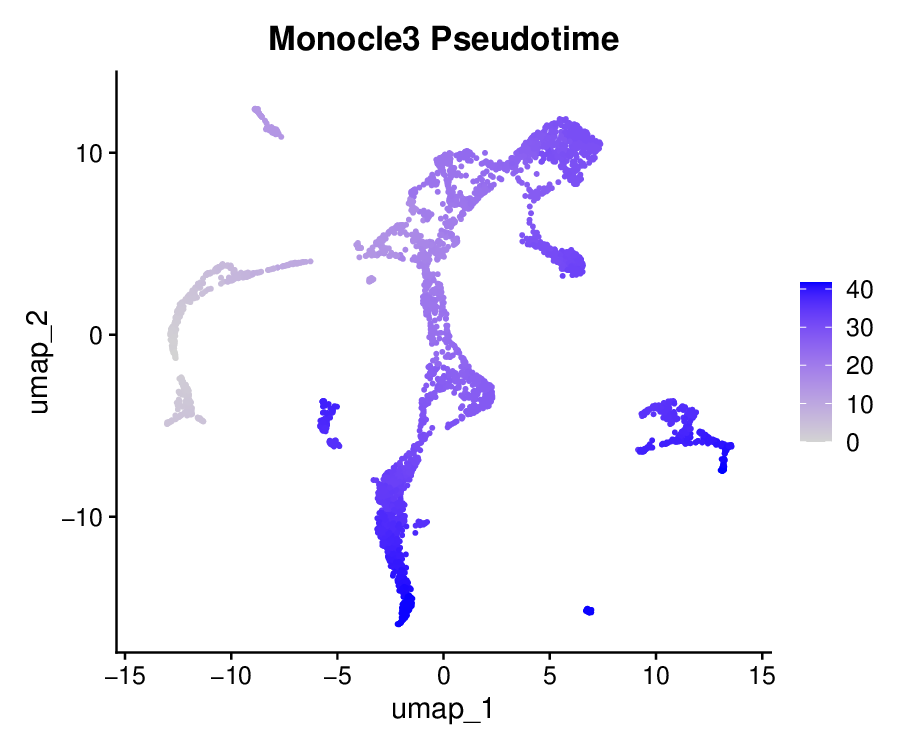
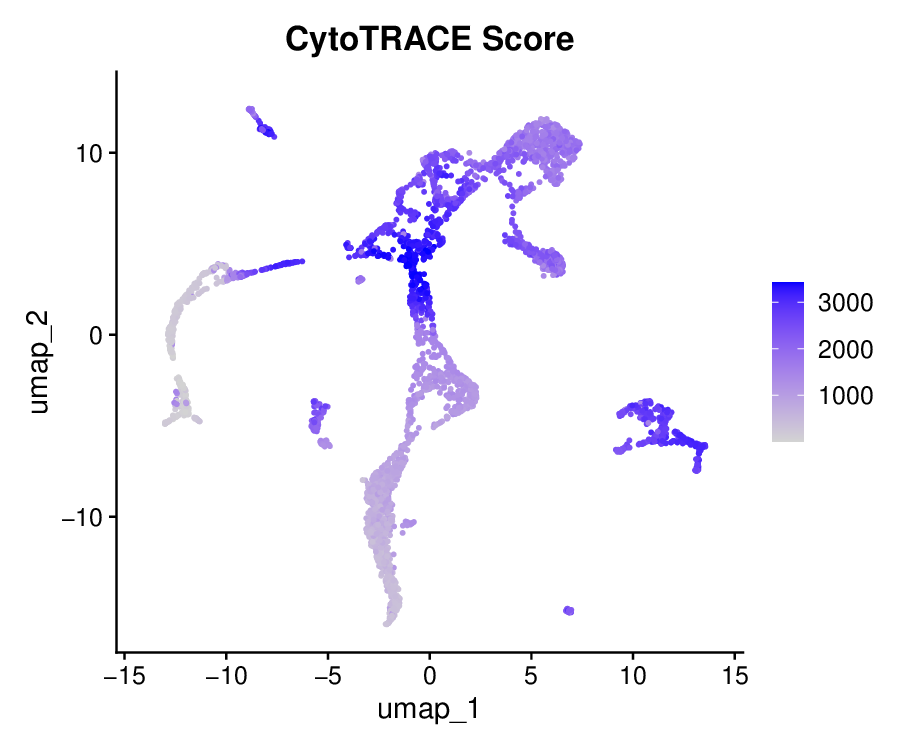
```

## 3. Define lineage-specific marker sets

BioTrajX needs to know which genes mark the **early** (stem/progenitor) state and
which mark the **terminal** state **for each branch separately**. The early markers
are the same for both lineages (stem progenitor identity), while the terminal
markers differ.

```{r markers}
expr <- as.matrix(GetAssayData(stem_cell, layer = "data"))

# Stem/progenitor markers — shared early state for both lineages.
# Selected by strongest negative Spearman correlation with Slingshot pseudotime
# in both branches simultaneously.
# Refs: Nestorowa et al. 2016 (Blood); Orkin & Zon 2008 (Cell)
stem_progenitor_genes <- c(
  "Kit", "Tslp", "Eltd1", "Rab38", "Cd34",
  "Ppic", "Fkbp11", "Cd27"
)

# Erythroid terminal markers — strongest positive Spearman correlation with
# Slingshot pseudotime in the Stem→Ery branch.
# ModuleScore: Erythrocytes = +3.0, Ery_progenitors = +2.15.
# Refs: Paul et al. 2015 (Cell); Orkin & Zon 2008 (Cell)
erythrocyte_genes <- c(
  "Snca", "Hbb-b1", "Hba-a1", "Hba-a2", "Alas2",
  "Bpgm", "Hbb-b2", "Trim10", "Gypa", "Slc4a1"
)

# B cell terminal markers — strongest positive Spearman correlation with
# Slingshot pseudotime in the Stem→B branch.
# ModuleScore: Immature_B = +1.23, Mature_B = +0.99.
# Refs: Paul et al. 2015 (Cell); Nestorowa et al. 2016 (Blood)
bcell_genes <- c(
  "Pou2af1", "Vpreb3", "Slamf7", "Blnk", "Cd79a",
  "Cd79b", "Cd19", "Ebf1", "Irf4"
)
```

### Alternative: build marker lists from a data frame

When markers for multiple branches live in a single table — whether from a
CellMarker download or an in-house spreadsheet — `get_markers_cellmarker()` and
`markers_to_list()` replace the manual construction above.

```{r markers-df-alt, eval = FALSE}
# --- Option A: auto-download from CellMarker (requires internet) ---
ms_ery <- get_markers_cellmarker(
  early    = "Hematopoietic stem cell",
  terminal = "Red blood cell (erythrocyte)",
  species  = "Mouse",
  tissue   = "Bone marrow"
)

ms_b <- get_markers_cellmarker(
  early    = "Hematopoietic stem cell",
  terminal = "B cell",
  species  = "Mouse",
  tissue   = "Bone marrow"
)

# --- Option B: use a pre-downloaded file ---
# df <- read.table("Mouse_cell_markers.txt",
#                  sep = "\t", header = TRUE, quote = "", fill = TRUE)
# ms_ery <- get_markers_cellmarker("Hematopoietic stem cell", "Erythrocyte", df = df)
```

## 4. Define branched trajectories

Assemble the per-branch marker lists and specify which cell clusters belong to
each lineage. `branch_filters$include` restricts DOE computation to only the
cells on that branch, preventing signal from the other lineage from diluting
the metrics.

```{r branches}
# Both lineages share the same early (stem) markers
early_markers_list <- list(
  Stem_to_Ery = stem_progenitor_genes,
  Stem_to_B   = stem_progenitor_genes
)

# Terminal markers differ per lineage
terminal_markers_list <- list(
  Stem_to_Ery = erythrocyte_genes,
  Stem_to_B   = bcell_genes
)

# Which Phenotype clusters to include in each branch
branch_filters <- list(
  Stem_to_Ery = list(
    include   = c("Stem_Progenitors", "Megakaryocyte_progenitors",
                  "Erythroid_progenitors_Erythroblasts", "Erythrocytes"),
    min_cells = 50
  ),
  Stem_to_B = list(
    include   = c("Stem_Progenitors", "Immature_B", "Mature_B"),
    min_cells = 50
  )
)

# Pseudotime vectors — pulled from pre-computed Seurat metadata
pseudotime_methods <- list(
  Slingshot  = stem_cell$Slingshot,
  CytoTRACE  = stem_cell$CytoTRACE,
  Monocle3   = stem_cell$Monocle3,
  DPT        = stem_cell$DPT,
  SCORPIUS   = stem_cell$SCORPIUS,
  TSCAN      = stem_cell$TSCAN,
  `PAGA-DPT` = stem_cell$`PAGA-DPT`,
  Palantir   = stem_cell$Palantir
)
```

## 5. Compute DOE for a single pseudotime method

Before comparing methods, it is useful to inspect results for one method in
detail. `compute_single_doe_branched()` evaluates D, O, and E separately for
each branch and returns an aggregated score.

```{r single-doe}
res_single_br <- compute_single_doe_branched(
  expr_or_seurat        = stem_cell,
  pseudotime            = pseudotime_methods$Monocle3,
  early_markers_list    = early_markers_list,
  terminal_markers_list = terminal_markers_list,
  cluster_labels        = "Phenotype",
  branch_filters        = branch_filters,
  verbose               = TRUE
)

plot(res_single_br, type = "bar")
plot(res_single_br, type = "radar")
plot(res_single_br, type = "heatmap")
```

```{r single-doe-plots, echo = FALSE, eval = TRUE, out.width = "100%"}
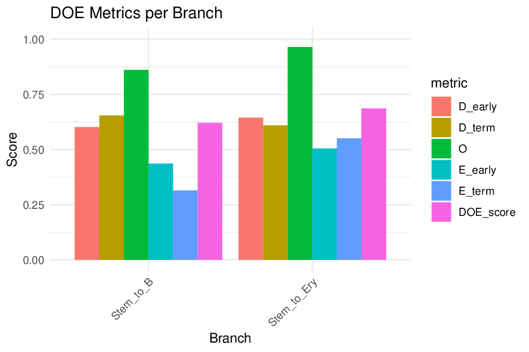
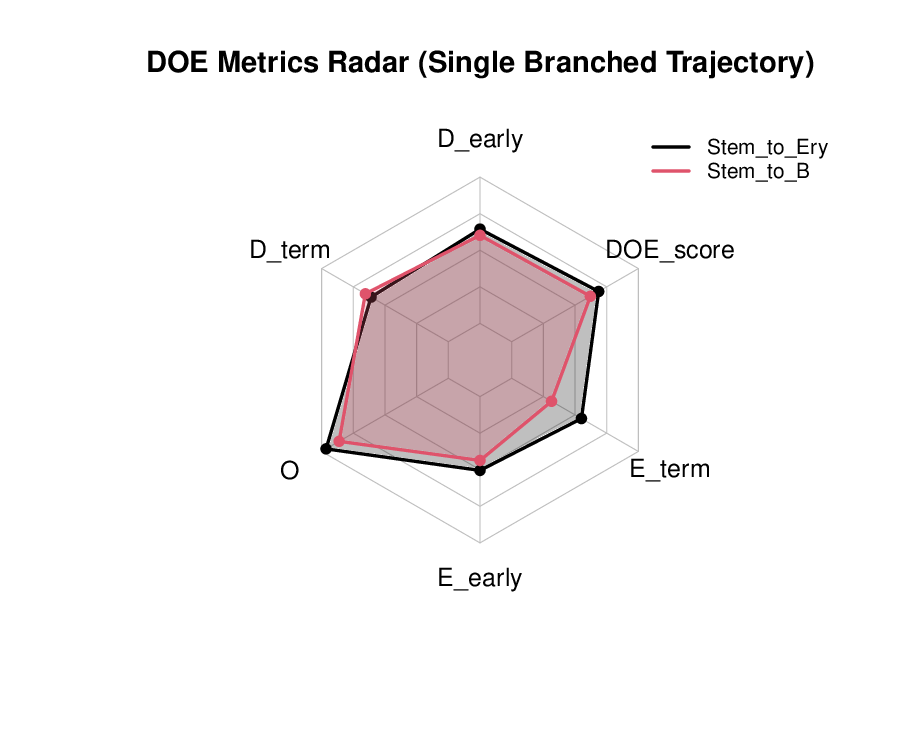
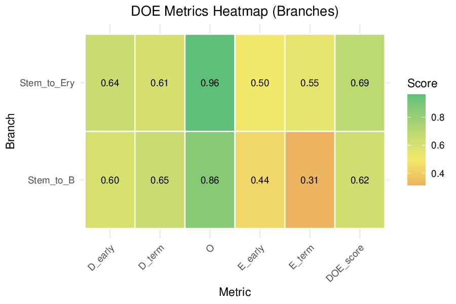
```

## 6. Compute DOE across multiple pseudotime methods

`compute_multi_doe_branched()` runs the same evaluation for every method in
`pseudotime_methods` and collates the results for direct comparison.

```{r multi-doe}
res_multi <- compute_multi_doe_branched(
  expr_or_seurat        = stem_cell,
  pseudotime_list       = pseudotime_methods,
  early_markers_list    = early_markers_list,
  terminal_markers_list = terminal_markers_list,
  cluster_labels        = "Phenotype",
  branch_filters        = branch_filters,
  verbose               = TRUE
)
```

## 7. Visualize multi-method branched DOE results

```{r plot-multi}
# Faceted bar plot — one panel per branch, methods on the x-axis
plot(res_multi, scope = "branch",
     metrics = c("D_early", "D_term", "O", "E_early", "E_term", "DOE_score"),
     type = "bar", branch_mode = "facet")

# Heatmap with branch labels stacked into the y-axis
plot(res_multi, scope = "branch",
     type = "heatmap", branch_mode = "stack")

# Radar plot — one radar per branch
plot(res_multi, scope = "branch",
     type = "radar", branch_mode = "separate")

# Overall aggregate DOE across all methods (collapses both branches)
plot(res_multi, scope = "overall", type = "bar")
```

```{r results-plots, echo = FALSE, eval = TRUE, out.width = "100%"}
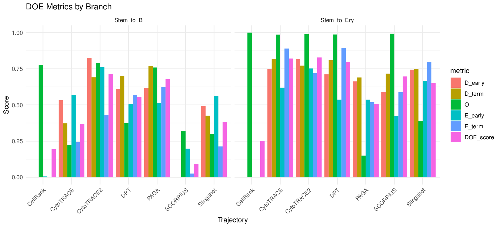
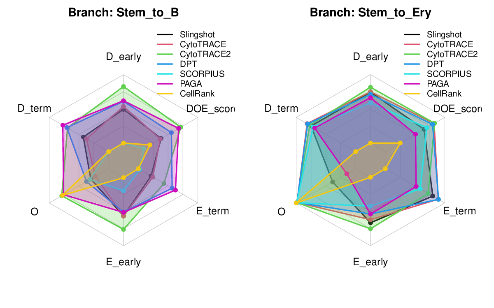
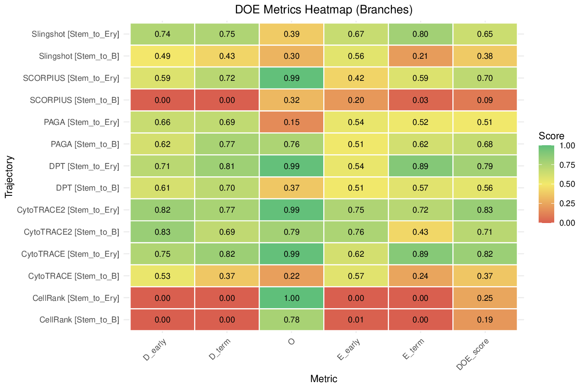
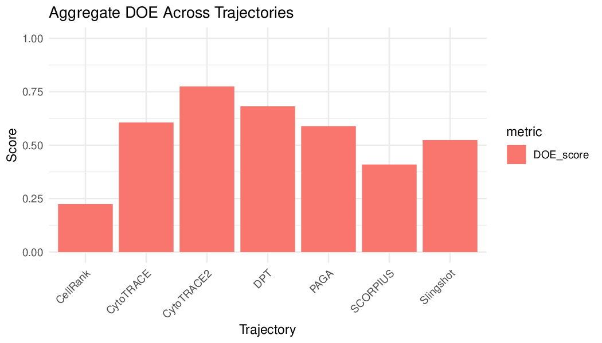
```

## 8. What do the top methods actually look like?

Ground-truth `Phenotype` next to each method's pseudotime, on the same UMAP —
the real result from this dataset in the BioTrajX manuscript (Figure S10a):

```{r umap-grid-eval, eval = FALSE}
DimPlot(stem_cell, group.by = "Phenotype") + ggplot2::labs(title = "Ground truth")
FeaturePlot(stem_cell, features = "Slingshot") + ggplot2::labs(title = "Slingshot")
FeaturePlot(stem_cell, features = "Monocle3")  + ggplot2::labs(title = "Monocle3")
# ... one panel per method
```

```{r s10-umap-grid, echo = FALSE, eval = TRUE, out.width = "100%"}
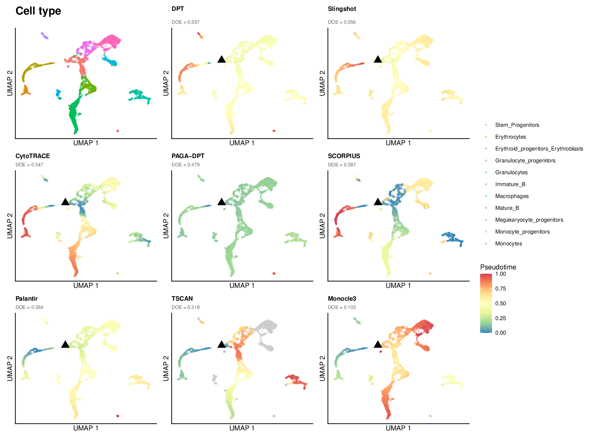
```

## 9. Per-branch pseudotime, ranked by that branch's own DOE score

A method can do well on one lineage and poorly on the other — `scope =
"branch"` scoring exists precisely so each branch is judged on its own
markers and cell subset. Rank each branch's method panels by that branch's
own `DOE_score` (not the aggregate) so the best-performing method for *that*
lineage comes first:

```{r branch-umap-order, eval = FALSE}
ery_order <- res_multi$comparison_by_branch |>
  subset(branch == "Stem_to_Ery") |>
  (\(df) df$trajectory[order(-df$DOE_score)])()

# FeaturePlot(subset(stem_cell, Phenotype %in% branch_filters$Stem_to_Ery$include),
#             features = ery_order) # one panel per method, in DOE order
```

```{r s10-branch-umap, echo = FALSE, eval = TRUE, out.width = "100%"}
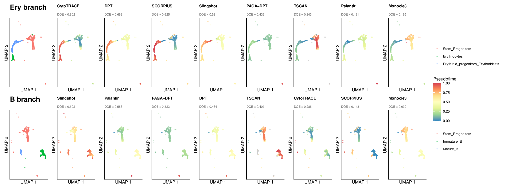
```

## 10. Module score trends, one row per branch

Each branch has its own early/terminal modules (stem-progenitor vs.
erythroid for Stem→Ery, stem-progenitor vs. B cell for Stem→B) and its own
DOE-based method ordering:

```{r module-trends-branch, eval = FALSE}
stem_cell <- AddModuleScore(stem_cell, features = list(stem_progenitor_genes), name = "early_mod")
stem_cell <- AddModuleScore(stem_cell, features = list(erythrocyte_genes),     name = "ery_mod")
stem_cell <- AddModuleScore(stem_cell, features = list(bcell_genes),           name = "bcell_mod")

plot_branch_trends <- function(branch, terminal_score_col, terminal_label) {
  order_br <- subset(res_multi$comparison_by_branch, branch == !!branch)
  order_br <- order_br$trajectory[order(-order_br$DOE_score)]
  cells    <- colnames(stem_cell)[stem_cell$Phenotype %in% branch_filters[[branch]]$include]

  df <- do.call(rbind, lapply(order_br, function(m) {
    pt <- pseudotime_methods[[m]][cells]
    data.frame(Pseudotime = pt,
               Score  = c(stem_cell$early_mod1[cells], stem_cell[[terminal_score_col]][cells]),
               Module = rep(c("Early", terminal_label), each = length(pt)),
               Method = m)
  }))
  df$Method <- factor(df$Method, levels = order_br)

  ggplot2::ggplot(df, ggplot2::aes(Pseudotime, Score, colour = Module)) +
    ggplot2::geom_point(size = 0.2, alpha = 0.12) +
    ggplot2::geom_smooth(method = "loess", se = TRUE, span = 0.5) +
    ggplot2::facet_wrap(~ Method, nrow = 1, scales = "free") +
    ggplot2::theme_minimal()
}

plot_branch_trends("Stem_to_Ery", "ery_mod1",   "Erythrocyte")
plot_branch_trends("Stem_to_B",   "bcell_mod1", "B cell")
```

```{r s10-module-trends, echo = FALSE, eval = TRUE, out.width = "100%"}
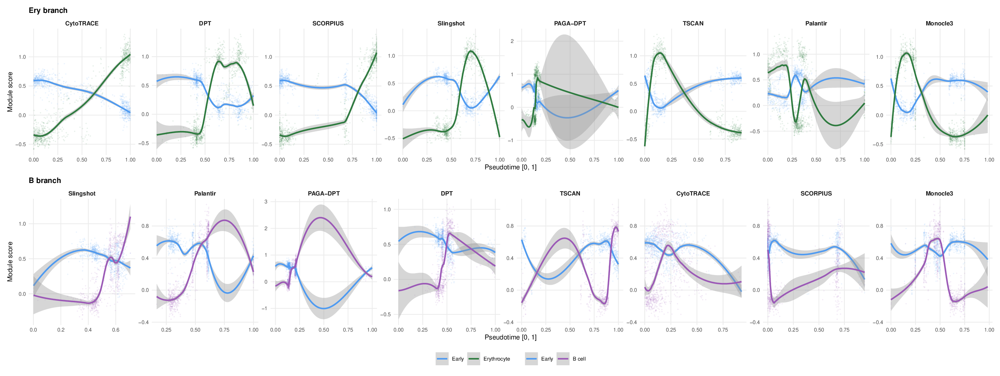
```

## 11. Gene-level trends and cell-type recovery, per branch

The same GAM-fit-gene-vs-pseudotime and violin-by-celltype views from the
linear vignette apply per branch here. Below is the Stem→Erythroid branch;
calling the same code with `branch_filters$Stem_to_B` and the B-cell marker
genes produces the equivalent pair of panels for the Stem→B branch.

```{r gam-violin-branch, eval = FALSE}
ery_cells <- colnames(stem_cell)[stem_cell$Phenotype %in% branch_filters$Stem_to_Ery$include]
ery_order <- subset(res_multi$comparison_by_branch, branch == "Stem_to_Ery")
ery_order <- ery_order$trajectory[order(-ery_order$DOE_score)]

# GAM fits of a few marker genes vs. pseudotime, faceted by method
gam_df <- do.call(rbind, lapply(ery_order, function(m) {
  pt <- pseudotime_methods[[m]][ery_cells]
  do.call(rbind, lapply(c("Cd34", "Alas2", "Gypa"), function(g) {
    data.frame(Method = m, Gene = g, Pseudotime = pt, Expr = expr[g, ery_cells])
  }))
}))
gam_df$Method <- factor(gam_df$Method, levels = ery_order)

ggplot2::ggplot(gam_df, ggplot2::aes(Pseudotime, Expr)) +
  ggplot2::geom_point(size = 0.15, alpha = 0.08, colour = "grey50") +
  ggplot2::geom_smooth(method = "gam", formula = y ~ s(x, bs = "cs")) +
  ggplot2::facet_grid(Method ~ Gene, scales = "free_y") +
  ggplot2::theme_minimal()

# Violin of pseudotime by cell type, faceted by method
violin_df <- do.call(rbind, lapply(ery_order, function(m) {
  data.frame(Method = m, CellType = stem_cell$Phenotype[ery_cells],
             Pseudotime = pseudotime_methods[[m]][ery_cells])
}))
violin_df$Method <- factor(violin_df$Method, levels = ery_order)

ggplot2::ggplot(violin_df, ggplot2::aes(CellType, Pseudotime)) +
  ggplot2::geom_violin(ggplot2::aes(fill = CellType), scale = "width") +
  ggplot2::geom_boxplot(width = 0.15, outlier.size = 0.4) +
  ggplot2::facet_wrap(~ Method, ncol = 3) +
  ggplot2::theme_classic()
```

```{r s10-gam-violin, echo = FALSE, eval = TRUE, out.width = "100%"}
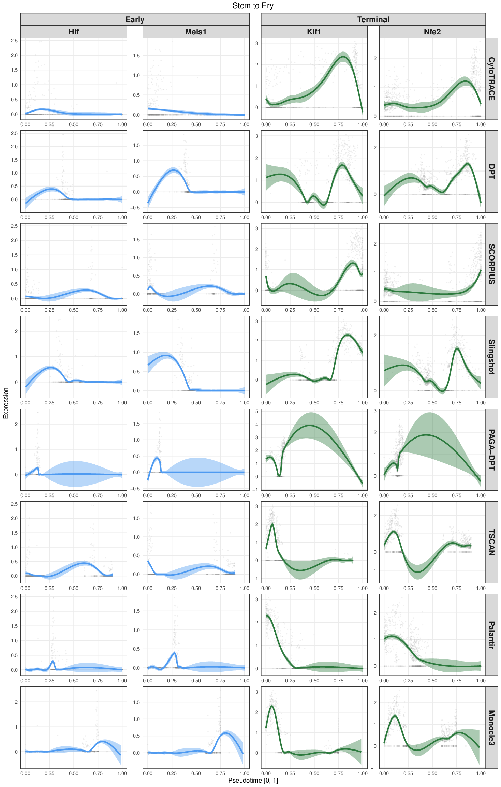
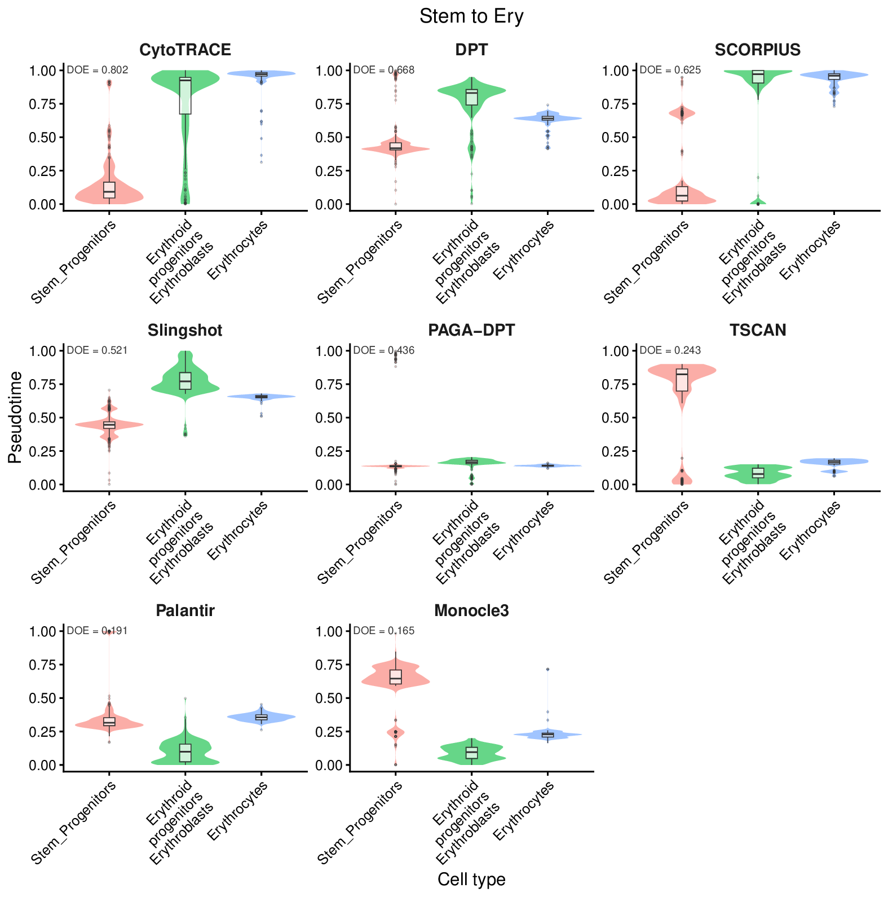
```
