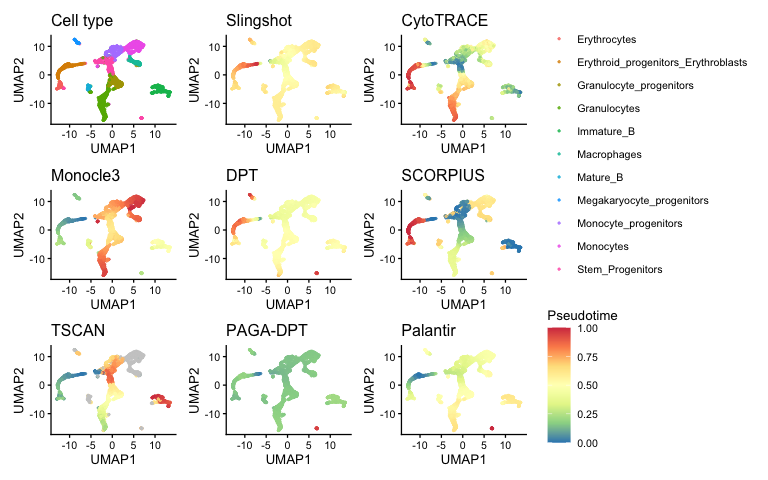
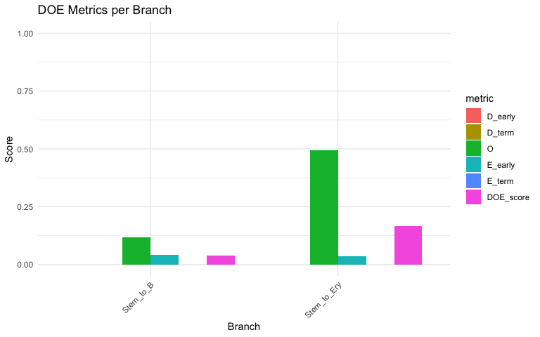
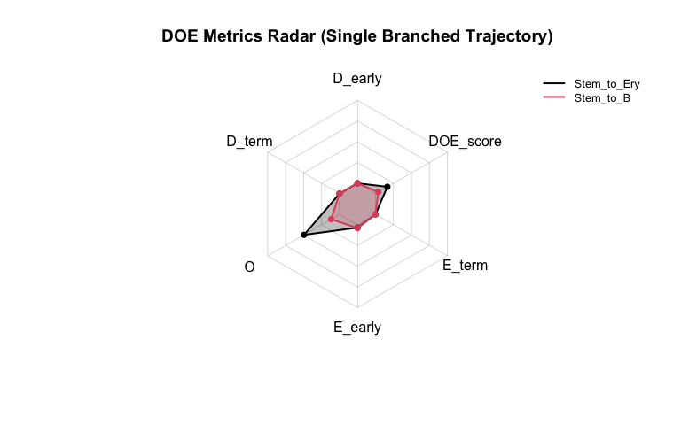
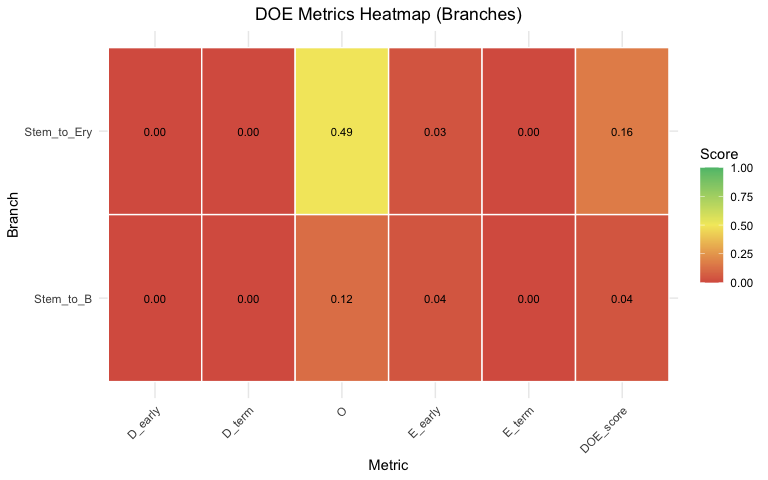
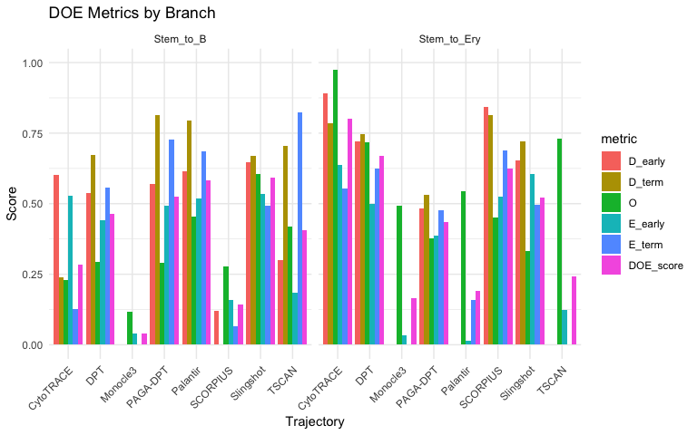
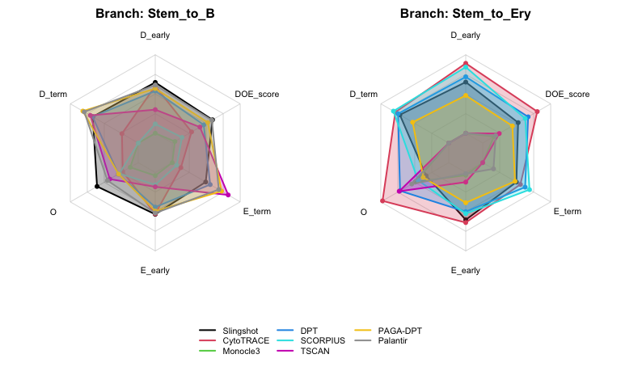
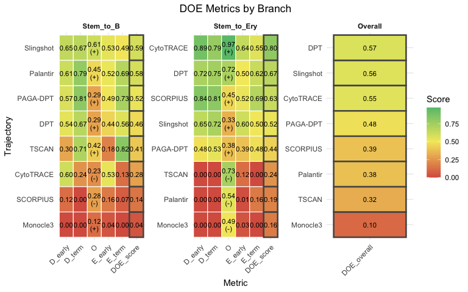
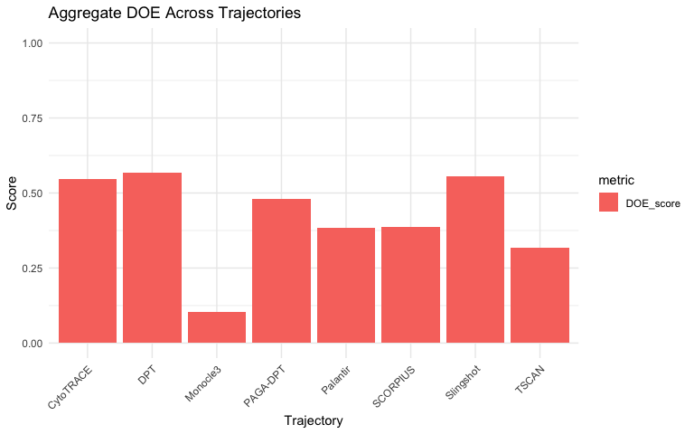
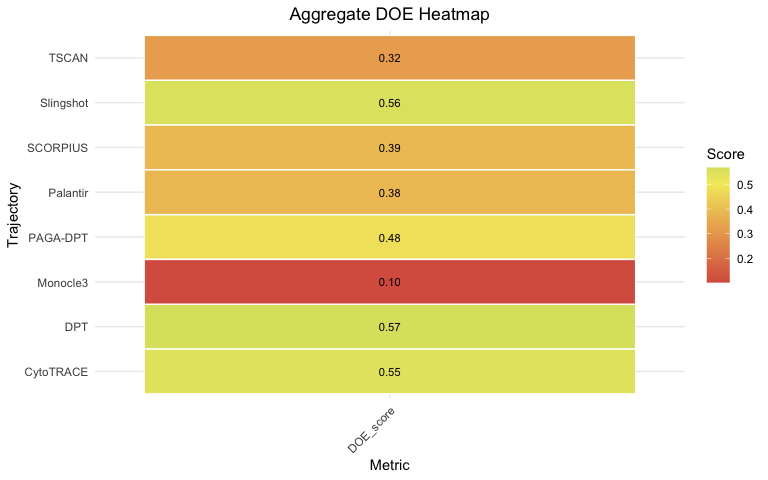

Evaluating Branched Pseudotime Trajectories with BioTrajX
================

This article walks through applying BioTrajX’s DOE metrics to a branched
haematopoietic stem cell differentiation dataset: aging mouse
hematopoietic stem and progenitor cells, where the `Stem_Progenitors`
compartment bifurcates into an erythroid lineage
(`Erythroid_progenitors_Erythroblasts` → `Erythrocytes`) and a B-cell
lineage (`Immature_B` → `Mature_B`). As in the linear-trajectory
vignette, pseudotime from eight TI methods is already computed and
stored as `meta.data` columns.

## 1. Load the data

``` r
library(BioTrajX)
library(Seurat)

dir.create("data", showWarnings = FALSE)
download.file(
  "<ZENODO FILE URL>/stem_cell.rds",
  "data/stem_cell.rds",
  mode = "wb"
)
stem <- readRDS("data/stem_cell.rds")
stem
#> An object of class Seurat 
#> 13526 features across 3427 samples within 1 assay 
#> Active assay: RNA (13526 features, 3000 variable features)
#>  3 layers present: counts, data, scale.data
#>  2 dimensional reductions calculated: pca, umap
```

`stem$Phenotype` holds the ten cell-type labels, and the same eight
TI-method pseudotime columns used in the linear-trajectory vignette
(`Slingshot`, `CytoTRACE`, `Monocle3`, `DPT`, `SCORPIUS`, `TSCAN`,
`PAGA-DPT`, `Palantir`) are already present in `meta.data`.

## 2. Visualize branch labels and pseudotime

One UMAP panel for the `Phenotype` labels, plus one panel per TI method
colored by that method’s pseudotime:

``` r
pt_cols <- c("Slingshot", "CytoTRACE", "Monocle3", "DPT",
             "SCORPIUS", "TSCAN", "PAGA-DPT", "Palantir")

umap_df <- as.data.frame(Embeddings(stem, "umap"))
colnames(umap_df) <- c("UMAP1", "UMAP2")
umap_df$CellType <- stem$Phenotype[rownames(umap_df)]

p_celltype <- ggplot2::ggplot(umap_df, ggplot2::aes(UMAP1, UMAP2, colour = CellType)) +
  ggplot2::geom_point(size = 0.5, alpha = 0.7) +
  ggplot2::theme_classic(base_size = 10) +
  ggplot2::labs(title = "Cell type", colour = NULL)

method_plots <- lapply(pt_cols, function(method) {
  df <- cbind(umap_df[, c("UMAP1", "UMAP2")], Pseudotime = stem@meta.data[[method]])
  ggplot2::ggplot(df, ggplot2::aes(UMAP1, UMAP2, colour = Pseudotime)) +
    ggplot2::geom_point(size = 0.5, alpha = 0.7) +
    # Fixed limits (pseudotime is always on a [0, 1] scale here) so every
    # panel's colour scale is identical — that's what lets patchwork collapse
    # them into one shared legend instead of repeating it on every panel.
    ggplot2::scale_colour_distiller(palette = "Spectral", direction = -1,
                                     na.value = "grey80", limits = c(0, 1)) +
    ggplot2::theme_classic(base_size = 10) +
    ggplot2::labs(title = method)
})

if (requireNamespace("patchwork", quietly = TRUE)) {
  patchwork::wrap_plots(c(list(p_celltype), method_plots), ncol = 3) +
    patchwork::plot_layout(guides = "collect") &
    ggplot2::theme(legend.position = "right")
} else {
  p_celltype
  method_plots
}
```

<!-- -->

## 3. Get lineage-specific markers

Each branch needs its own early/terminal marker pair: a shared stem/
progenitor signature as the “early” set, and a lineage-specific terminal
signature per branch. `get_markers_msigdb()` pulls these by gene-set
name, and `filter_markers()` keeps only the genes well-detected in this
dataset.

``` r
ms_ery <- get_markers_msigdb(
  early    = "HAY_BONE_MARROW_CD34_POS_HSC",
  terminal = "WP_ERYTHROPOIESIS",
  species  = "Mus musculus"
)
ms_b <- get_markers_msigdb(
  early    = "HAY_BONE_MARROW_CD34_POS_HSC",
  terminal = "HADDAD_B_LYMPHOCYTE_PROGENITOR",
  species  = "Mus musculus"
)

fm_ery <- filter_markers(ms_ery, stem, top_n = 30, min_detection = 0.10)
fm_b   <- filter_markers(ms_b,   stem, top_n = 30, min_detection = 0.10)
```

`species = "Mus musculus"` with human-named gene sets (e.g.
`WP_ERYTHROPOIESIS`) makes `msigdbr` map human MSigDB to mouse via
orthology rather than querying mouse-native collections — that’s
expected here, since these signature names only exist in the human
MSigDB. If this errors with `No gene sets found for: ...` on a set
that clearly exists, check `packageVersion("msigdbr")`: 26.1.0 shipped
with an ortholog-table caching bug that could silently drop genes (or
whole sets) from the second `msigdbr()` call in a session when mapping
human to mouse. Run `install.packages("msigdbr")` to pick up 26.1.1+,
which fixes it (BioTrajX’s `DESCRIPTION` requires `msigdbr >= 26.1.1`
for this reason). If the update doesn’t take effect, restart R — like
`rlang`, an already-loaded `msigdbr` can’t be swapped out mid-session.

## 4. Define the branch structure

Branched DOE functions take `early_markers_list`/`terminal_markers_list`
as **named lists keyed by branch name** — the union of these names
defines the branches BioTrajX will evaluate. `branch_filters` then tells
BioTrajX which `Phenotype` labels belong to each branch:

``` r
early_markers_list <- list(
  Stem_to_Ery = fm_ery$early,
  Stem_to_B   = fm_b$early
)
terminal_markers_list <- list(
  Stem_to_Ery = fm_ery$terminal,
  Stem_to_B   = fm_b$terminal
)

branch_filters <- list(
  Stem_to_Ery = list(
    include   = c("Stem_Progenitors", "Erythroid_progenitors_Erythroblasts", "Erythrocytes"),
    min_cells = 50
  ),
  Stem_to_B = list(
    include   = c("Stem_Progenitors", "Immature_B", "Mature_B"),
    min_cells = 50
  )
)
```

## 5. Evaluate a single pseudotime trajectory

``` r
res_single <- compute_single_doe_branched(
  expr_or_seurat         = stem,
  pseudotime             = stem$Monocle3,
  early_markers_list     = early_markers_list,
  terminal_markers_list  = terminal_markers_list,
  cluster_labels         = "Phenotype",
  branch_filters         = branch_filters,
  E_method               = "gmm"
)

res_single$aggregate_DOE
#> [1] 0.1028302
plot(res_single, type = "bar")
```

<!-- -->

``` r
plot(res_single, type = "radar")
```

<!-- -->

``` r
plot(res_single, type = "heatmap")
```

<!-- -->

## 6. Compare all eight methods, per branch

``` r
pt_list <- setNames(lapply(pt_cols, function(col) stem@meta.data[[col]]), pt_cols)
pt_list <- pt_list[sapply(pt_list, function(x) sum(!is.na(x)) > 10)]

res <- compute_multi_doe_branched(
  expr_or_seurat         = stem,
  pseudotime_list        = pt_list,
  early_markers_list     = early_markers_list,
  terminal_markers_list  = terminal_markers_list,
  cluster_labels         = "Phenotype",
  branch_filters         = branch_filters,
  E_method               = "gmm"
)
#> 
#> ==========================================================
#> Multi-trajectory branched DOE analysis complete!
#> Best overall trajectory: DPT (DOE: 0.567)
#> 
#> Best trajectory per branch:
#>   - Stem_to_B: Slingshot (DOE: 0.592)
#>   - Stem_to_Ery: CytoTRACE (DOE: 0.802)

res$comparison_overall
#>           trajectory aggregate_DOE
#> DPT              DPT     0.5673202
#> Slingshot  Slingshot     0.5562964
#> CytoTRACE  CytoTRACE     0.5466295
#> PAGA-DPT    PAGA-DPT     0.4792064
#> SCORPIUS    SCORPIUS     0.3873401
#> Palantir    Palantir     0.3841835
#> TSCAN          TSCAN     0.3179244
#> Monocle3    Monocle3     0.1028302
plot(res, scope = "branch", type = "bar", branch_mode = "facet")
```

<!-- -->

``` r
plot(res, scope = "branch", type = "radar", branch_mode = "facet")
```

<!-- -->

``` r
plot(res, scope = "branch", type = "heatmap", branch_mode = "facet")
```

<!-- -->

``` r
plot(res, scope = "overall", type = "bar")
```

<!-- -->

``` r
plot(res, scope = "overall", type = "heatmap")
```

<!-- -->

`scope = "overall"` only carries one score per trajectory
(`aggregate_DOE`) — there’s no per-metric D/O/E breakdown at that level
to put on a radar’s axes, so `type = "radar"` isn’t available for
`scope = "overall"`; use `scope = "branch"` for a per-metric radar
instead.

## 7. Overall rank vs. per-branch rank

A method that looks best overall is not necessarily the best choice for
every branch — `compute_multi_doe_branched()` tracks branch-specific
rankings precisely so you can catch that:

``` r
res$comparison_overall
#>           trajectory aggregate_DOE
#> DPT              DPT     0.5673202
#> Slingshot  Slingshot     0.5562964
#> CytoTRACE  CytoTRACE     0.5466295
#> PAGA-DPT    PAGA-DPT     0.4792064
#> SCORPIUS    SCORPIUS     0.3873401
#> Palantir    Palantir     0.3841835
#> TSCAN          TSCAN     0.3179244
#> Monocle3    Monocle3     0.1028302
res$comparison_by_branch
#>         branch trajectory  DOE_score
#> 1    Stem_to_B  Slingshot 0.59242823
#> 2    Stem_to_B   Palantir 0.58273455
#> 3    Stem_to_B   PAGA-DPT 0.52335619
#> 4    Stem_to_B        DPT 0.46390004
#> 5    Stem_to_B      TSCAN 0.40715373
#> 6    Stem_to_B  CytoTRACE 0.28452127
#> 7    Stem_to_B   SCORPIUS 0.14345137
#> 8    Stem_to_B   Monocle3 0.03932814
#> 9  Stem_to_Ery  CytoTRACE 0.80225789
#> 10 Stem_to_Ery        DPT 0.66818361
#> 11 Stem_to_Ery   SCORPIUS 0.62519936
#> 12 Stem_to_Ery  Slingshot 0.52105783
#> 13 Stem_to_Ery   PAGA-DPT 0.43614800
#> 14 Stem_to_Ery      TSCAN 0.24301300
#> 15 Stem_to_Ery   Palantir 0.19054095
#> 16 Stem_to_Ery   Monocle3 0.16476236
res$best_per_branch
#>                  branch best_trajectory best_score
#> Stem_to_B     Stem_to_B       Slingshot  0.5924282
#> Stem_to_Ery Stem_to_Ery       CytoTRACE  0.8022579
```

A method that wins on the erythroid branch can rank far lower on the
B-cell branch (and vice versa); the overall `aggregate_DOE` score is a
cell-count- weighted average across branches, so it can mask a method
that’s excellent on one branch and poor on the other.
