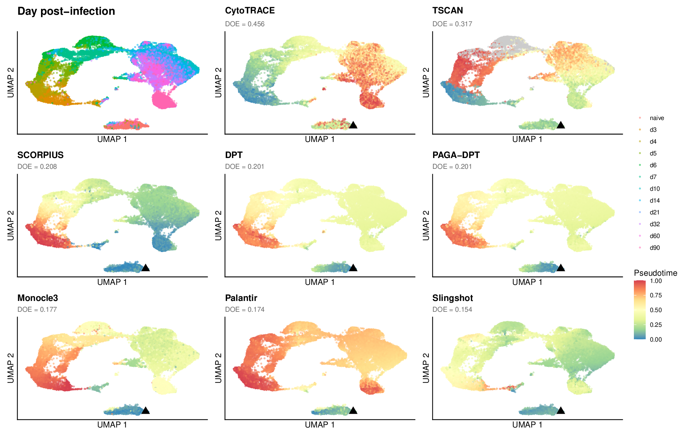
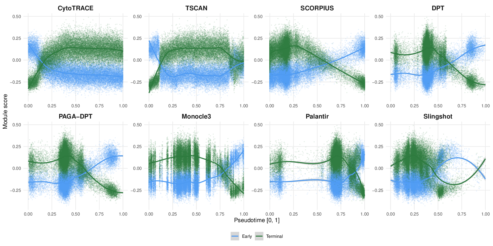
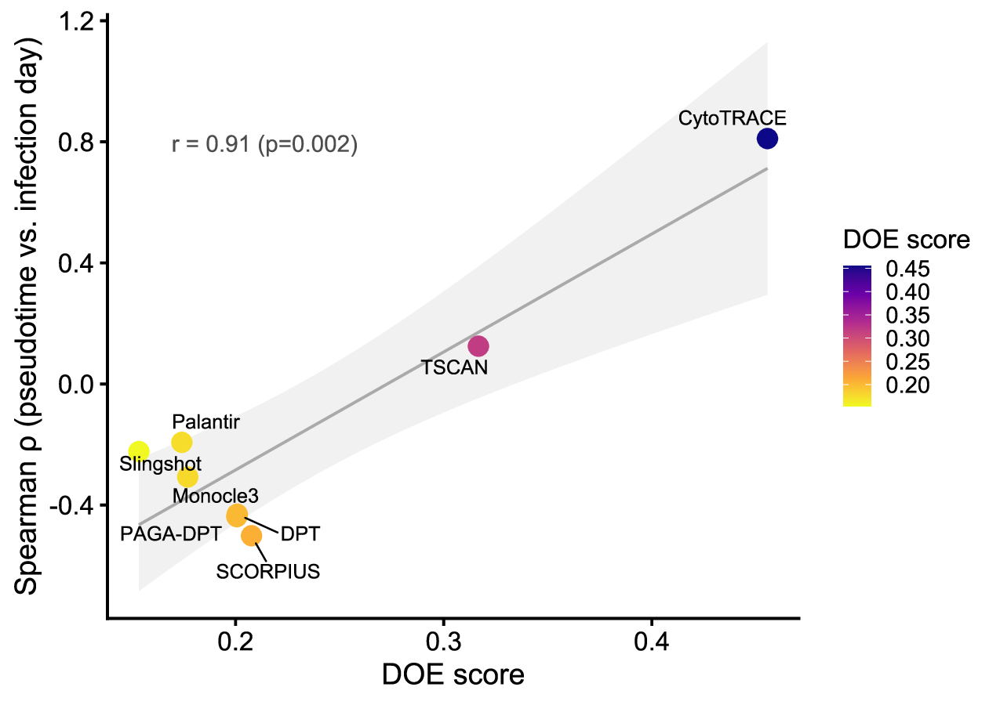
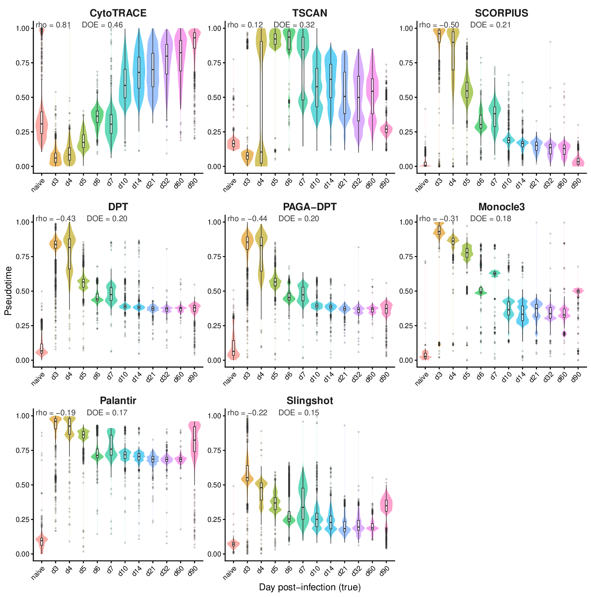

```{r setup, include = FALSE}
knitr::opts_chunk$set(
  collapse = TRUE,
  comment = "#>",
  fig.width = 8,
  fig.height = 5,
  warning = FALSE,
  message = FALSE,
  eval = FALSE   # requires downloaded data — run interactively after loading GSE131847_seu.rds
)
```

The linear and branched vignettes evaluate DOE against literature marker
genes and known cell-type clusters — reasonable proxies for "did this method
get the biology right," but not a direct check against ground truth. This
dataset (GSE131847, an LCMV infection time course spanning naive → day-90
post-infection CD8+ T cells) is the one case in the BioTrajX manuscript where
the *true* biological ordering is known for every cell: each cell is labeled
with its actual day of infection. That makes it possible to ask directly:
**does a method's DOE score — computed without ever looking at that label —
predict how well its pseudotime recovers the real day-of-infection
ordering?**

## 1. Load the dataset and pre-computed pseudotimes

```{r load-data}
library(BioTrajX)
library(Seurat)

obj <- readRDS("data/GSE131847_seu.rds")
DefaultAssay(obj) <- "SCT"
```

As in the other vignettes, pseudotime vectors from multiple TI methods are
expected as columns of a data frame keyed by cell — produced the same way,
via `manuscript/scripts/real/run_ti_methods.R`'s `run_all_ti_methods()`:

```{r run-ti, eval = FALSE}
source("manuscript/scripts/real/run_ti_methods.R")

expr <- as.matrix(GetAssayData(obj, layer = "data"))
ti_df <- run_all_ti_methods(expr, start_cell = colnames(expr)[which(obj$cell_type == "naive")[1]])
```

## 2. Marker genes and DOE

Naive vs. LCMV-effector marker genes come from MSigDB (mouse), filtered down
to genes actually well-detected in this dataset:

```{r markers-doe}
ms <- get_markers_msigdb(
  early      = "GSE41867_NAIVE_VS_DAY8_LCMV_EFFECTOR_CD8_TCELL_UP",
  terminal   = "GSE41867_NAIVE_VS_DAY8_LCMV_EFFECTOR_CD8_TCELL_DN",
  collection = NULL,
  species    = "Mus musculus"
)
ms <- filter_markers(ms, obj, top_n = 30, min_detection = 0.10)

ti_methods <- c("PAGA-DPT", "CytoTRACE", "Monocle3", "DPT", "Slingshot",
                "SCORPIUS", "TSCAN", "Palantir")
pt_list <- as.list(ti_df[, colnames(ti_df) %in% ti_methods, drop = FALSE])

res <- compute_multi_doe_linear(
  expr_or_seurat   = obj,
  pseudotime_list  = pt_list,
  early_markers    = ms$early,
  terminal_markers = ms$terminal
)
```

## 3. What the trajectories look like

Ground-truth day of infection next to each method's pseudotime, and the
resulting module-score trends:

```{r s8-umap-modules, echo = FALSE, eval = TRUE, out.width = "100%"}


```

## 4. Does the DOE score predict ground-truth recovery?

For each method, compute the Spearman correlation between its pseudotime and
the true numeric day of infection — this is the actual recovery quality,
something you'd normally never have access to. Then check whether `DOE_score`
(computed with no knowledge of `true_day`) tracks that recovery quality
across methods:

```{r day-corr-vs-doe}
day_lookup <- c(naive = 0, d3 = 3, d4 = 4, d5 = 5, d6 = 6, d7 = 7,
                d10 = 10, d14 = 14, d21 = 21, d32 = 32, d60 = 60, d90 = 90)
true_day <- day_lookup[as.character(obj$cell_type)]
names(true_day) <- colnames(obj)

doe_lookup <- setNames(res$comparison_summary$DOE_score,
                       res$comparison_summary$trajectory)

day_corr <- do.call(rbind, lapply(names(pt_list), function(m) {
  pt <- pt_list[[m]]
  cells <- intersect(names(pt)[!is.na(pt)], names(true_day))
  sp <- cor.test(pt[cells], true_day[cells], method = "spearman")
  data.frame(Method = m, DOE_score = doe_lookup[[m]],
             spearman_rho = unname(sp$estimate))
}))

# The number that answers the question: does DOE score predict recovery
# of the known ground truth, across methods?
cor.test(day_corr$DOE_score, day_corr$spearman_rho, method = "pearson")
```

```{r s8-day-corr, echo = FALSE, eval = TRUE, out.width = "100%"}

```

Each point is one TI method: its DOE score (x-axis, computed label-free) vs.
how well its pseudotime actually recovered the true day-of-infection
ordering (y-axis, Spearman ρ against ground truth, which BioTrajX never
sees). The positive trend is the validation result: methods BioTrajX scores
highly are, independently, the methods that best recover known biology.

## 5. The same result at the per-cell level

```{r pseudotime-vs-day}
day_long <- do.call(rbind, lapply(names(pt_list), function(m) {
  pt <- pt_list[[m]]
  cells <- intersect(names(pt)[!is.na(pt)], names(true_day))
  data.frame(Method = m, Day = as.character(obj$cell_type[cells]),
             Pseudotime = pt[cells])
}))
day_long$Method <- factor(day_long$Method,
                          levels = day_corr$Method[order(-day_corr$DOE_score)])
day_long$Day <- factor(day_long$Day, levels = names(day_lookup))

ggplot2::ggplot(day_long, ggplot2::aes(Day, Pseudotime)) +
  ggplot2::geom_violin(ggplot2::aes(fill = Day), scale = "width") +
  ggplot2::geom_boxplot(width = 0.15, outlier.size = 0.4) +
  ggplot2::facet_wrap(~ Method, ncol = 3) +
  ggplot2::theme_classic() +
  ggplot2::labs(x = "Day post-infection (true)", y = "Pseudotime")
```

```{r s8-violin, echo = FALSE, eval = TRUE, out.width = "100%"}

```

Panels are ordered by DOE score, high to low. The best-scoring methods show
pseudotime distributions that climb steadily across the true day-of-infection
axis; lower-scoring methods show flatter or noisier distributions — visible
confirmation, at the single-cell level, of the same result as panel 4.
