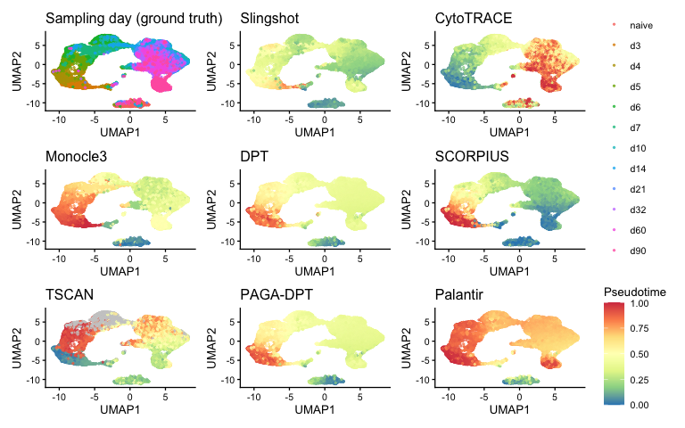
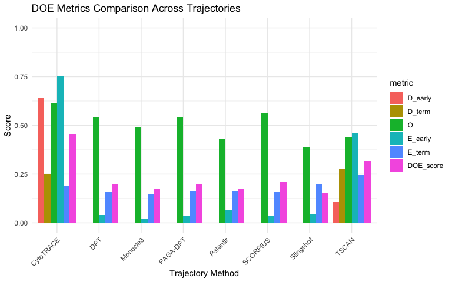
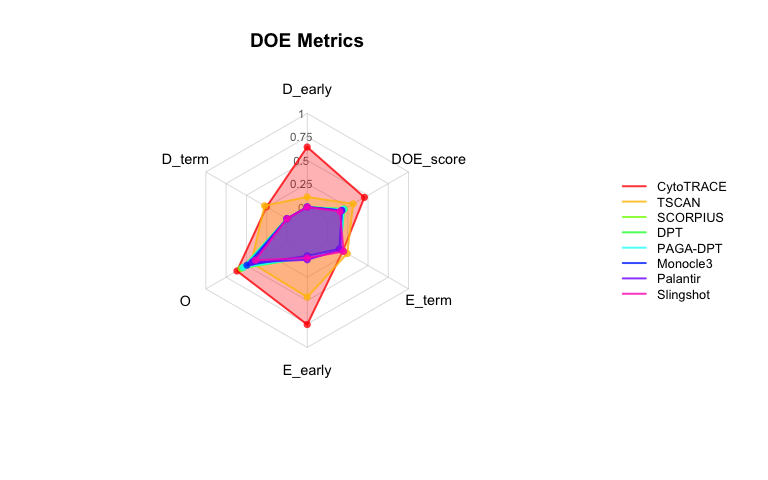
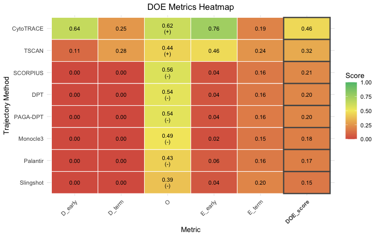

Validating BioTrajX Against Ground Truth (GSE131847 LCMV Time Course)
================

The linear-trajectory and branched-trajectory vignettes evaluate DOE
against literature marker genes and known cell-type clusters — proxies
for “did this method get the biology right,” but not a direct check
against ground truth of *time*. This vignette uses a dataset where the
real sampling time is known: an LCMV infection time course (GSE131847),
where CD8⁺ T cells were collected at defined days post-infection
(`naive`, `d3`, …, `d90`). Since the true ordering of cells is known
here, we can ask directly: does a method’s DOE score actually track how
well its pseudotime recovers the real timeline?

As with the other two vignettes, pseudotime from eight TI methods is
already computed and stored as `meta.data` columns.

## 1. Load the data

``` r
library(BioTrajX)
library(Seurat)

dir.create("data", showWarnings = FALSE)
download.file(
  "<ZENODO FILE URL>/GSE131847_seu.rds",
  "data/GSE131847_seu.rds",
  mode = "wb"
)
gse <- readRDS("data/GSE131847_seu.rds")
DefaultAssay(gse) <- "SCT"
gse
#> An object of class Seurat 
#> 19876 features across 26261 samples within 2 assays 
#> Active assay: SCT (9935 features, 3000 variable features)
#>  3 layers present: counts, data, scale.data
#>  1 other assay present: RNA
#>  2 dimensional reductions calculated: pca, umap
```

`gse$cell_type` is not a cell *type* in the usual sense — it’s the known
sampling day (`naive`, `d3`, `d4`, …, `d90`), used here as ground truth
rather than as a biological cluster label. Setting the assay to `SCT`
ensures marker scoring and DOE both use SCTransform-normalized
expression, which is how this dataset was processed upstream.

## 2. Visualize sampling day and pseudotime

One UMAP panel for the known sampling day, plus one panel per TI method
colored by that method’s pseudotime:

``` r
pt_cols <- c("Slingshot", "CytoTRACE", "Monocle3", "DPT",
             "SCORPIUS", "TSCAN", "PAGA-DPT", "Palantir")

gse$cell_type <- factor(
  gse$cell_type,
  levels = c("naive", "d3", "d4", "d5", "d6", "d7", "d10", "d14", "d21", "d32", "d60", "d90")
)

umap_df <- as.data.frame(Embeddings(gse, "umap"))
colnames(umap_df) <- c("UMAP1", "UMAP2")
umap_df$Day <- gse$cell_type[rownames(umap_df)]

p_day <- ggplot2::ggplot(umap_df, ggplot2::aes(UMAP1, UMAP2, colour = Day)) +
  ggplot2::geom_point(size = 0.5, alpha = 0.7) +
  ggplot2::theme_classic(base_size = 10) +
  ggplot2::labs(title = "Sampling day (ground truth)", colour = NULL)

method_plots <- lapply(pt_cols, function(method) {
  df <- cbind(umap_df[, c("UMAP1", "UMAP2")], Pseudotime = gse@meta.data[[method]])
  ggplot2::ggplot(df, ggplot2::aes(UMAP1, UMAP2, colour = Pseudotime)) +
    ggplot2::geom_point(size = 0.5, alpha = 0.7) +
    # Fixed limits (pseudotime is always on a [0, 1] scale here) so every
    # panel's colour scale is identical — that's what lets patchwork collapse
    # them into one shared legend instead of repeating it on every panel.
    ggplot2::scale_colour_distiller(palette = "Spectral", direction = -1,
                                     na.value = "grey80", limits = c(0, 1)) +
    ggplot2::theme_classic(base_size = 10) +
    ggplot2::labs(title = method)
})

if (requireNamespace("patchwork", quietly = TRUE)) {
  patchwork::wrap_plots(c(list(p_day), method_plots), ncol = 3) +
    patchwork::plot_layout(guides = "collect") &
    ggplot2::theme(legend.position = "right")
} else {
  p_day
  method_plots
}
```

<!-- -->

## 3. Markers and multi-method DOE

``` r
marker_set <- get_markers_msigdb(
  early    = "GSE41867_NAIVE_VS_DAY8_LCMV_EFFECTOR_CD8_TCELL_UP",
  terminal = "GSE41867_NAIVE_VS_DAY8_LCMV_EFFECTOR_CD8_TCELL_DN",
  species  = "Mus musculus"
)
filtered <- filter_markers(marker_set, gse, top_n = 30, min_detection = 0.10)

pt_list <- setNames(lapply(pt_cols, function(col) gse@meta.data[[col]]), pt_cols)
pt_list <- pt_list[sapply(pt_list, function(x) sum(!is.na(x)) > 10)]

res <- compute_multi_doe_linear(
  expr_or_seurat   = gse,
  pseudotime_list  = pt_list,
  early_markers    = filtered$early,
  terminal_markers = filtered$terminal,
  cluster_labels   = "cell_type",
  E_method         = "gmm"
)
#> Computing DOE metrics for 8 trajectories...
#> ==========================================================
#> 
#> --- Processing trajectory: Slingshot ---
#> 
#> --- Processing trajectory: CytoTRACE ---
#> 
#> --- Processing trajectory: Monocle3 ---
#> 
#> --- Processing trajectory: DPT ---
#> 
#> --- Processing trajectory: SCORPIUS ---
#> 
#> --- Processing trajectory: TSCAN ---
#> 
#> --- Processing trajectory: PAGA-DPT ---
#> 
#> --- Processing trajectory: Palantir ---
#> 
#> ==========================================================
#> Multi-trajectory DOE analysis complete!
#> Best trajectory: CytoTRACE (DOE score: 0.456)
```

This dataset has ~26,000 cells, so `compute_multi_doe_linear()` can take
a few minutes and several GB of free memory to run across all eight
methods — that’s expected, not an error.

## 4. Visualize and rank

``` r
res$comparison_summary
#>   trajectory   D_early    D_term    D_comp         O O_orientation    E_early
#> 1  CytoTRACE 0.6406028 0.2517878 0.4461953 0.6165234             + 0.75545053
#> 2      TSCAN 0.1072321 0.2758025 0.1915173 0.4387440             + 0.46283016
#> 3   SCORPIUS 0.0000000 0.0000000 0.0000000 0.5644388             - 0.03598109
#> 4        DPT 0.0000000 0.0000000 0.0000000 0.5393507             - 0.03948773
#> 5   PAGA-DPT 0.0000000 0.0000000 0.0000000 0.5424115             - 0.03628602
#> 6   Monocle3 0.0000000 0.0000000 0.0000000 0.4931018             - 0.02180210
#> 7   Palantir 0.0000000 0.0000000 0.0000000 0.4311166             - 0.06357676
#> 8  Slingshot 0.0000000 0.0000000 0.0000000 0.3879122             - 0.04451898
#>      E_term     E_comp DOE_score has_error D_early_rank D_term_rank D_comp_rank
#> 1 0.1901569 0.30383466 0.4555178     FALSE            1           2           1
#> 2 0.2442388 0.31974559 0.3166690     FALSE            2           1           2
#> 3 0.1570928 0.05855137 0.2076634     FALSE            3           3           3
#> 4 0.1567881 0.06308678 0.2008125     FALSE            3           3           3
#> 5 0.1644065 0.05945072 0.2006207     FALSE            3           3           3
#> 6 0.1459698 0.03793780 0.1770132     FALSE            3           3           3
#> 7 0.1627305 0.09143213 0.1741829     FALSE            3           3           3
#> 8 0.1991467 0.07277027 0.1535608     FALSE            3           3           3
#>   O_rank E_early_rank E_term_rank E_comp_rank DOE_score_rank
#> 1      1            1           3           2              1
#> 2      6            2           1           1              2
#> 3      2            7           6           7              3
#> 4      4            5           7           5              4
#> 5      3            6           4           6              5
#> 6      5            8           8           8              6
#> 7      7            3           5           3              7
#> 8      8            4           2           4              8
res$best_trajectory
#> [1] "CytoTRACE"
plot(res, type = "bar")
```

<!-- -->

``` r
plot(res, type = "radar")
```

<!-- -->

``` r
plot(res, type = "heatmap")
```

<!-- -->

## 5. Does DOE_score rank trajectories consistently with ground-truth recovery?

Sampling day is not used in the DOE calculation and therefore provides
an independent ground-truth reference. Here, we ask whether the ranking
of trajectory configurations by DOE_score agrees with their ranking by
recovery of the known temporal progression, quantified as the
association between pseudotime and sampling day:

``` r
day_lookup <- c(naive = 0, d3 = 3, d4 = 4, d5 = 5, d6 = 6, d7 = 7,
                 d10 = 10, d14 = 14, d21 = 21, d32 = 32, d60 = 60, d90 = 90)
true_day <- day_lookup[as.character(gse$cell_type)]

recovery <- sapply(pt_list, function(pt) {
  suppressWarnings(cor(pt, true_day, method = "spearman", use = "complete.obs"))
})

comparison <- res$comparison_summary
comparison$day_recovery <- recovery[comparison$trajectory]
comparison[, c("trajectory", "DOE_score", "day_recovery")]
#>   trajectory DOE_score day_recovery
#> 1  CytoTRACE 0.4555178    0.8108262
#> 2      TSCAN 0.3166690    0.1248117
#> 3   SCORPIUS 0.2076634   -0.5013013
#> 4        DPT 0.2008125   -0.4302742
#> 5   PAGA-DPT 0.2006207   -0.4383006
#> 6   Monocle3 0.1770132   -0.3073337
#> 7   Palantir 0.1741829   -0.1928228
#> 8  Slingshot 0.1535608   -0.2231767

cor.test(comparison$DOE_score, comparison$day_recovery, method = "pearson")
#> 
#>  Pearson's product-moment correlation
#> 
#> data:  comparison$DOE_score and comparison$day_recovery
#> t = 5.4729, df = 6, p-value = 0.001554
#> alternative hypothesis: true correlation is not equal to 0
#> 95 percent confidence interval:
#>  0.5831669 0.9843191
#> sample estimates:
#>       cor 
#> 0.9127518
```
