```{r setup, include = FALSE}
knitr::opts_chunk$set(
  collapse = TRUE,
  comment = "#>",
  fig.width = 8,
  fig.height = 5,
  warning = FALSE,
  message = FALSE,
  eval = FALSE   # requires downloaded data — run interactively after loading cd8t.rds
)
```

This article walks through applying BioTrajX's DOE metrics to a real CD8⁺ T cell
exhaustion dataset (Naive → Terminal exhaustion), comparing multiple pseudotime
methods using the D, O, and E metrics.

## Supported trajectory inference methods

BioTrajX evaluates pseudotime from any TI method. The eight methods tested in
this package are listed below. You are not required to run all of them — pass
whichever pseudotime vectors you have to `compute_multi_doe_linear()`.

| Method | Type | Language | Notes |
|---|---|---|---|
| Slingshot | MST + principal curves | R | Recommended for linear trajectories |
| CytoTRACE | Gene count structure | R | No root cell needed |
| Monocle3 | Graph-based learning | R | Requires a root cell |
| DPT | Diffusion pseudotime | R | Requires a root cell |
| SCORPIUS | Dimensionality reduction | R | Designed for linear trajectories |
| TSCAN | MST on cluster centers | R | Only assigns pseudotime to cells on the main path |
| PAGA-DPT | Graph abstraction + DPT | Python | Requires `scanpy` conda env |
| Palantir | Markov-chain fate probabilities | Python | Requires `palantir` conda env |

`cd8t.rds` ships with all eight methods' pseudotime already computed and
stored as `@meta.data` columns (`Slingshot`, `CytoTRACE`, `Monocle3`, `DPT`,
`SCORPIUS`, `TSCAN`, `PAGA-DPT`, `Palantir`) — there's nothing to run before
Step 1. They were produced with
`manuscript/scripts/real/run_ti_methods.R`'s `run_all_ti_methods()`; the code
below is what generated them, kept here for reference or in case you want to
add a method of your own on top:

```{r run-ti, eval = FALSE}
source("manuscript/scripts/real/run_ti_methods.R")

# Identify a root cell (lowest naive marker expression)
expr       <- as.matrix(GetAssayData(cd8t, layer = "data"))
start_cell <- colnames(expr)[which.min(colMeans(expr[early, , drop = FALSE]))]

ti_results <- run_all_ti_methods(expr, start_cell = start_cell)

# Add all pseudotime vectors as metadata columns
cd8t <- AddMetaData(cd8t, ti_results)
```

## 1. Load the CD8⁺ T cell dataset

Download the Seurat object manually from the following link:

[**https://transfer.it/t/PFoL2d0hBZAT**](https://transfer.it/t/PFoL2d0hBZAT){.uri}

Then load it into your R session:

```{r load-data}
library(BioTrajX)
library(Seurat)

cd8t <- readRDS("data/cd8t.rds")
```

## 2. Visualize pseudotime and cluster annotations

```{r visualize}
DimPlot(cd8t, group.by = "functional.cluster")
FeaturePlot(cd8t, features = "Monocle3")
FeaturePlot(cd8t, features = "Slingshot")
FeaturePlot(cd8t, features = "CytoTRACE")
```

```{r umap-plots, echo = FALSE, eval = TRUE, out.width = "100%"}
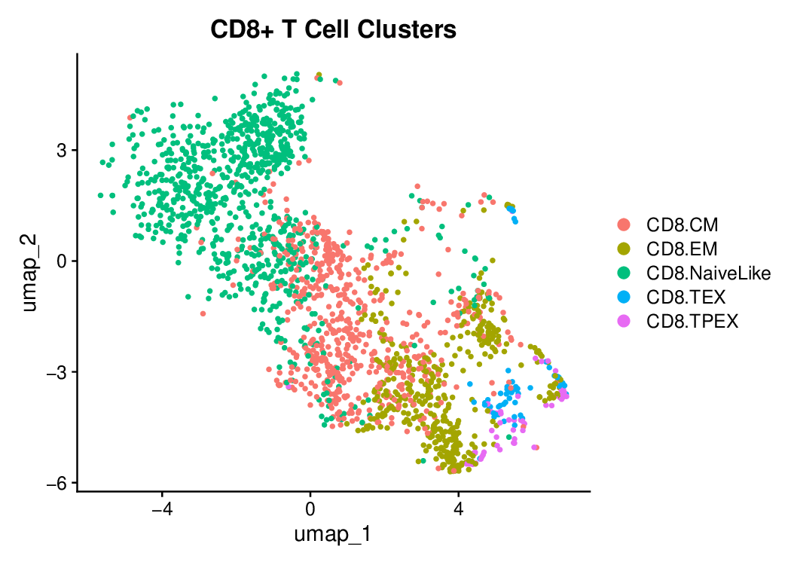
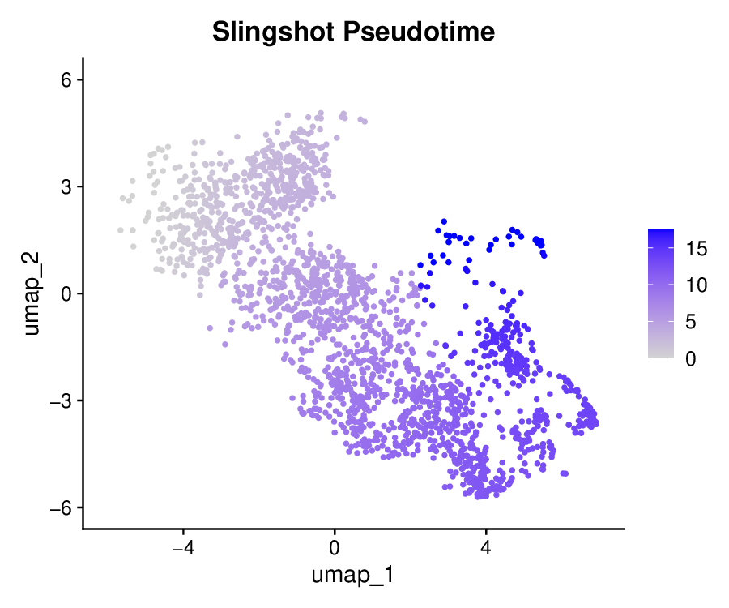
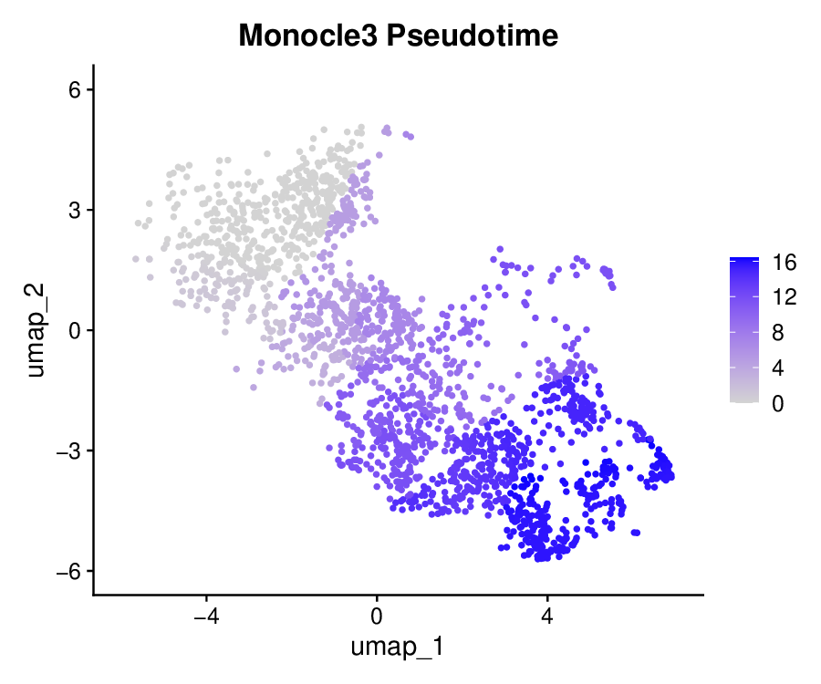
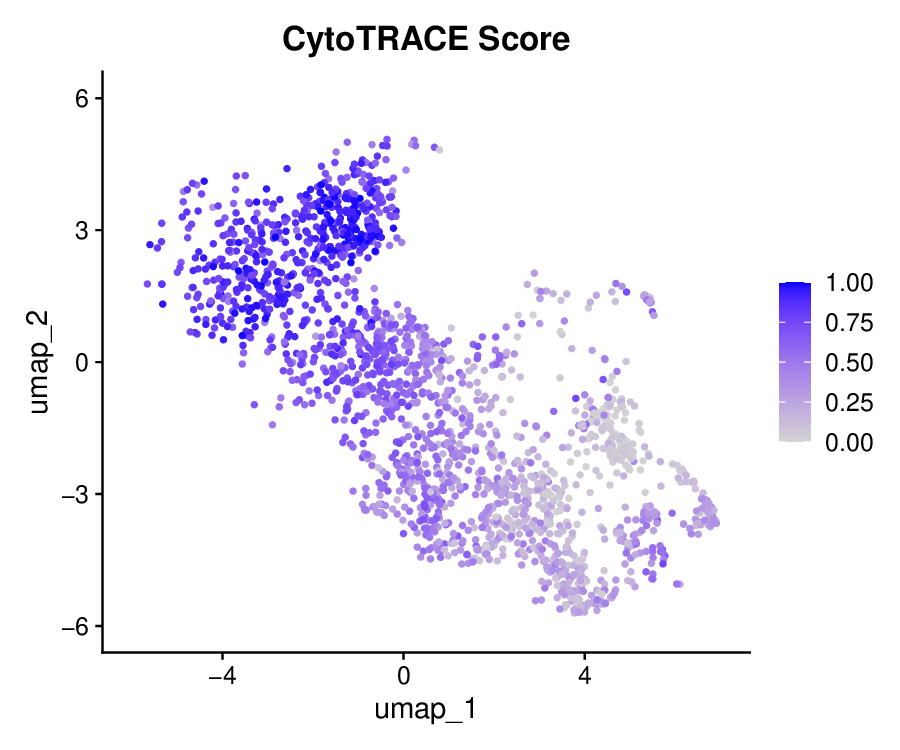
```

## 3. Prepare expression and marker genes

```{r prepare}
expr <- as.matrix(GetAssayData(cd8t, layer = "data"))

# Early-like markers: selected by strongest negative Spearman correlation with
# slingshot pseudotime among biologically interpretable genes (ribosomal/housekeeping
# excluded). These genes monotonically decrease along the CD8+ T cell exhaustion
# trajectory, analogous to early genes in the simulation vignette.
# ModuleScore: CD8.NaiveLike = +0.38, all exhausted clusters negative (to -0.65).
# Refs: Wherry & Kurachi 2015 (Nat Rev Immunol); Miller et al. 2019 (Nat Immunol)
early <- c(
  "LTB", "LDHB", "LEF1", "KLF2", "MAL",
  "SELL", "IL7R", "CCR7", "TCF7"
)

# Terminal markers: selected by strongest positive Spearman correlation with
# slingshot pseudotime — effector/exhaustion genes that monotonically increase
# along the trajectory (score: NaiveLike = -0.54, TEX = +1.30).
# Refs: Sade-Feldman et al. 2018 (Cell); Guo et al. 2018 (Nat Med)
term <- c(
  "SRGN", "GZMK", "CCL5", "NKG7", "RGS1",
  "CST7", "GZMA", "CXCL13", "TIGIT", "LAG3"
)

cluster <- cd8t$functional.cluster
```

```{r}
early <- c("CCR7", "TCF7", "IL7R")
term  <- c("PDCD1", "LAG3", "HAVCR2", "TOX", "TIGIT", "CTLA4", "CXCL13", "ENTPD1", "ITGAE")

cd8t <- AddModuleScore(cd8t,
  features = early,
  name = 'early_markers'
)

cd8t <- AddModuleScore(cd8t,
  features = term,
  name = 'term_markers'
)
```

```{r}
FeaturePlot(cd8t, features = "early_markers1") + ggplot2::ggtitle("Early Marker Expression")
FeaturePlot(cd8t, features = "term_markers1") + ggplot2::ggtitle("Terminal Marker Expression")
```


### Alternative: retrieve markers from MSigDB

The vectors above were curated manually from the literature.  As an alternative,\
`get_markers_msigdb()` can pull the same biological programs directly from MSigDB\
C2 (curated gene sets).  The result is a `marker_set` whose `$early` and\
`$terminal` slots are drop-in replacements for the character vectors above.

```{r msigdb-alt, eval = FALSE}
# install.packages("msigdbr")
ms <- get_markers_msigdb(
  early      = "GOLDRATH_NAIVE_VS_EFF_CD8_TCELL_UP",
  terminal   = "GSE9650_NAIVE_VS_EXHAUSTED_CD8_TCELL_UP",
  collection = "C7"   # immunologic signatures
)

# equivalent to passing `early` and `term` by hand
res_single <- compute_single_doe_linear(
  cd8t,
  cd8t$Slingshot,
  early_markers    = ms$early,
  terminal_markers = ms$terminal
)
```

You can also search by keyword when you do not know the exact set name:

```{r msigdb-pattern, eval = FALSE}
ms <- get_markers_msigdb(
  early      = "NAIVE.*CD8",
  terminal   = "EXHAUST.*CD8",
  collection = "C7",
  exact      = FALSE   # treat strings as grepl() patterns
)
```

## 4. Evaluate a single pseudotime trajectory

```{r single-doe}
res_single <- compute_single_doe_linear(
  cd8t,
  cd8t$Slingshot,
  early_markers    = early,
  terminal_markers = term
)
```

## 5. Visualize single-trajectory DOE results

```{r plot-single}
plot(res_single, type = "bar")
plot(res_single, type = "radar")
plot(res_single, type = "heatmap")
```

```{r single-doe-plots, echo = FALSE, eval = TRUE, out.width = "100%"}
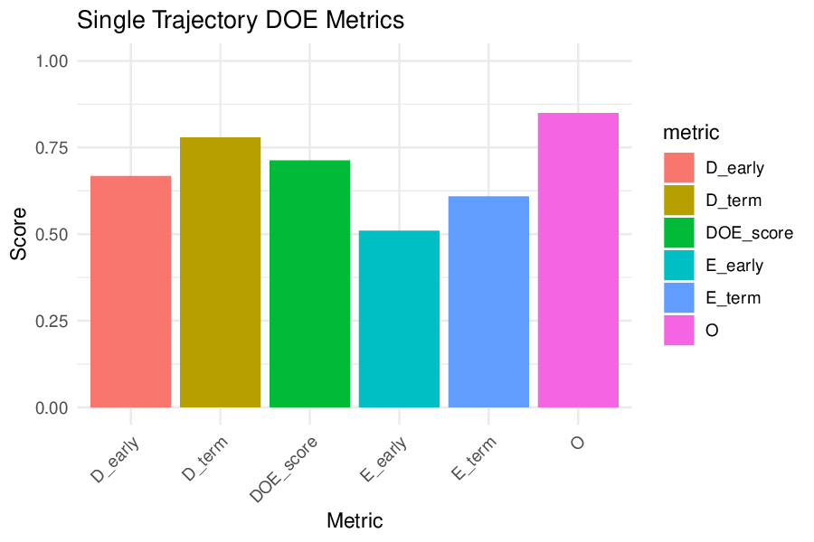
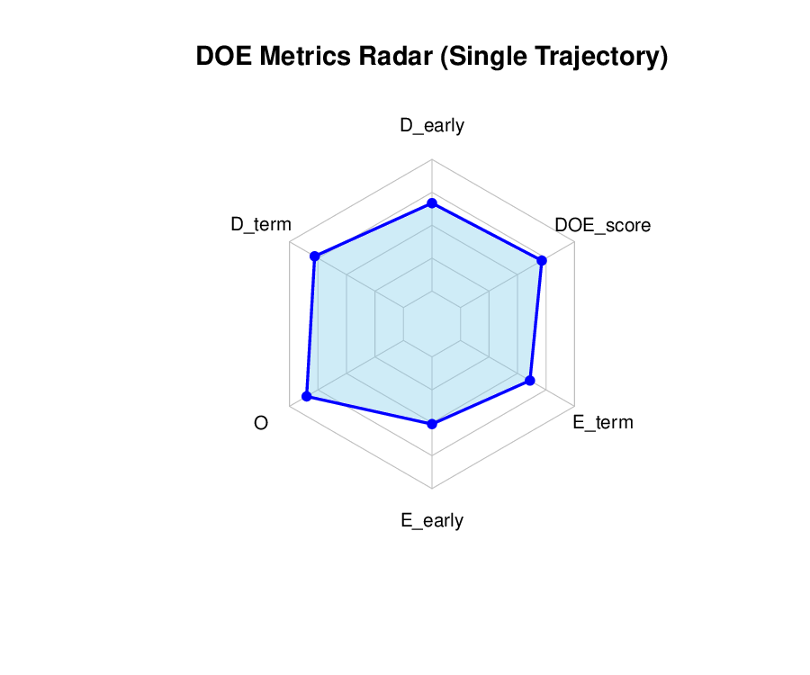
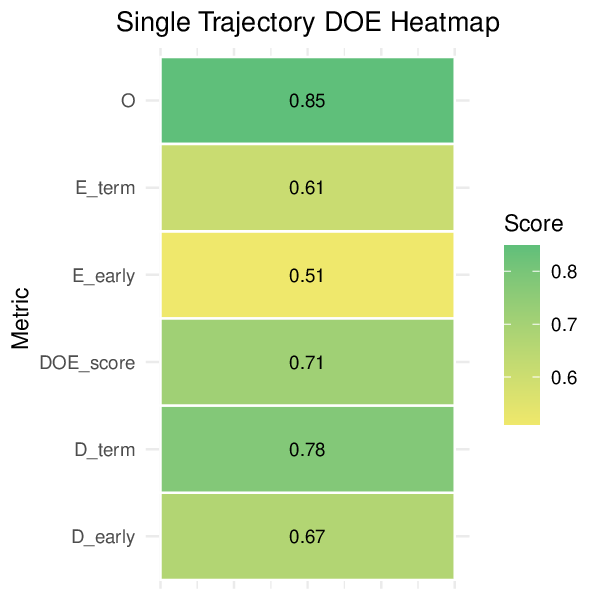
```

## 6. Evaluate multiple pseudotime methods simultaneously

```{r multi-doe}
pseudotime_methods <- list(
  Slingshot  = cd8t$Slingshot,
  CytoTRACE  = cd8t$CytoTRACE,
  Monocle3   = cd8t$Monocle3,
  DPT        = cd8t$DPT,
  SCORPIUS   = cd8t$SCORPIUS,
  TSCAN      = cd8t$TSCAN,
  `PAGA-DPT` = cd8t$`PAGA-DPT`,
  Palantir   = cd8t$Palantir
)

res <- compute_multi_doe_linear(
  expr,
  pseudotime_list  = pseudotime_methods,
  early_markers    = early,
  terminal_markers = term
)
```

## 7. Visualize multi-trajectory DOE results

```{r plot-multi}
plot(res, type = "bar")
plot(res, type = "radar")
plot(res, type = "heatmap")
```

```{r results-plots, echo = FALSE, eval = TRUE, out.width = "100%"}
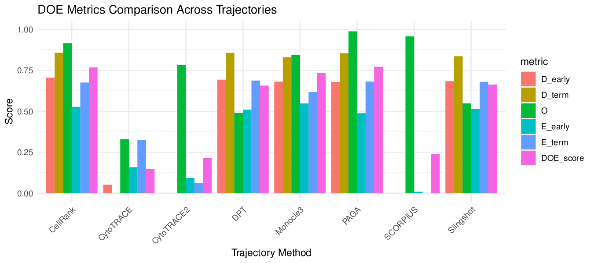
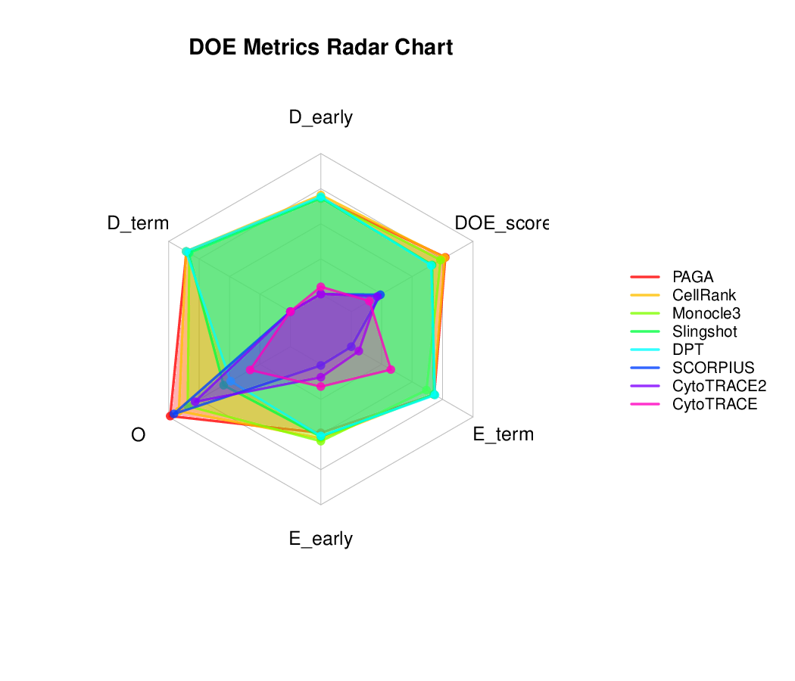
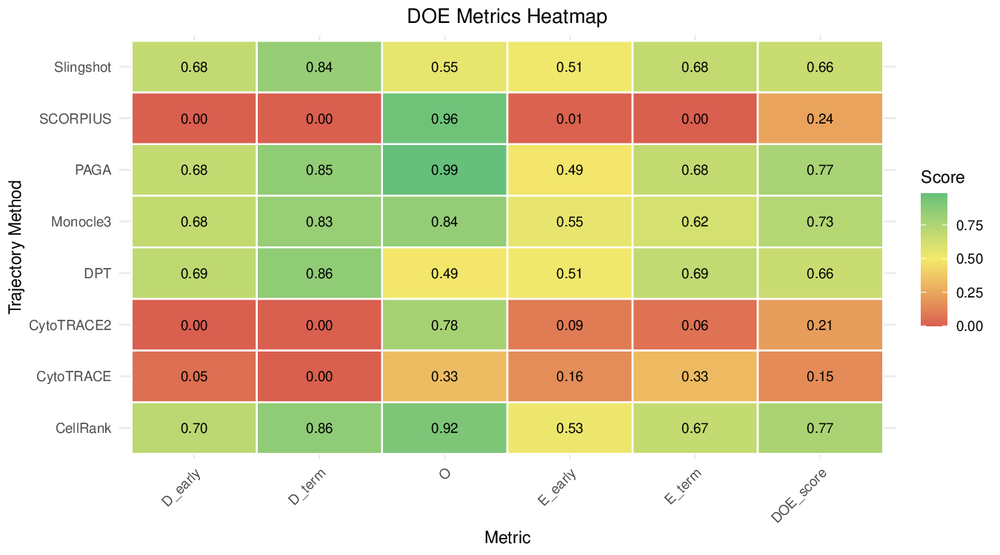
```

## 8. What do the top methods actually look like?

The bar/radar/heatmap views above rank methods by a single number, but it's
worth sanity-checking that ranking against the actual pseudotime. Below is
the real result from this dataset in the BioTrajX manuscript (Figure S9a):
ground-truth cluster identity next to each method's pseudotime, painted onto
the same UMAP.

```{r umap-grid-eval, eval = FALSE}
DimPlot(cd8t, group.by = "functional.cluster") + ggplot2::labs(title = "Ground truth")
FeaturePlot(cd8t, features = "Slingshot") + ggplot2::labs(title = "Slingshot")
FeaturePlot(cd8t, features = "Monocle3")  + ggplot2::labs(title = "Monocle3")
# ... one panel per method, ideally ordered by DOE score (highest first)
```

```{r s9-umap-grid, echo = FALSE, eval = TRUE, out.width = "100%"}
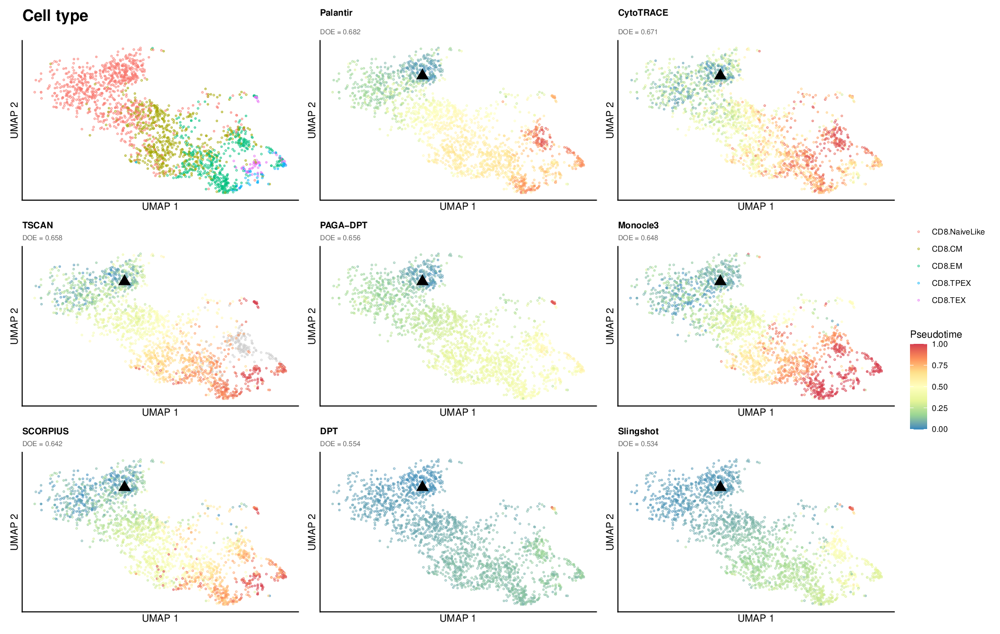
```

## 9. Module score trends by method

A high DOE score should mean the early-state module score falls and the
terminal-state module score rises smoothly across pseudotime — and that this
holds *within* each method's own pseudotime, not just on average. Order the
panels by `DOE_score` so the best-performing methods sit up front:

```{r module-trends, eval = FALSE}
cd8t <- AddModuleScore(cd8t, features = list(early), name = "early_mod")
cd8t <- AddModuleScore(cd8t, features = list(term),  name = "term_mod")

method_order <- res$comparison_summary$trajectory[order(-res$comparison_summary$DOE_score)]

trend_df <- do.call(rbind, lapply(method_order, function(m) {
  pt <- pseudotime_methods[[m]]
  data.frame(
    Pseudotime = pt,
    Score      = c(cd8t$early_mod1, cd8t$term_mod1),
    Module     = rep(c("Early", "Terminal"), each = length(pt)),
    Method     = m
  )
}))
trend_df$Method <- factor(trend_df$Method, levels = method_order)

ggplot2::ggplot(trend_df, ggplot2::aes(Pseudotime, Score, colour = Module)) +
  ggplot2::geom_point(size = 0.2, alpha = 0.15) +
  ggplot2::geom_smooth(method = "loess", se = TRUE, span = 0.4) +
  ggplot2::facet_wrap(~ Method, ncol = 4, scales = "free_x") +
  ggplot2::theme_minimal()
```

```{r s9-module-trends, echo = FALSE, eval = TRUE, out.width = "100%"}
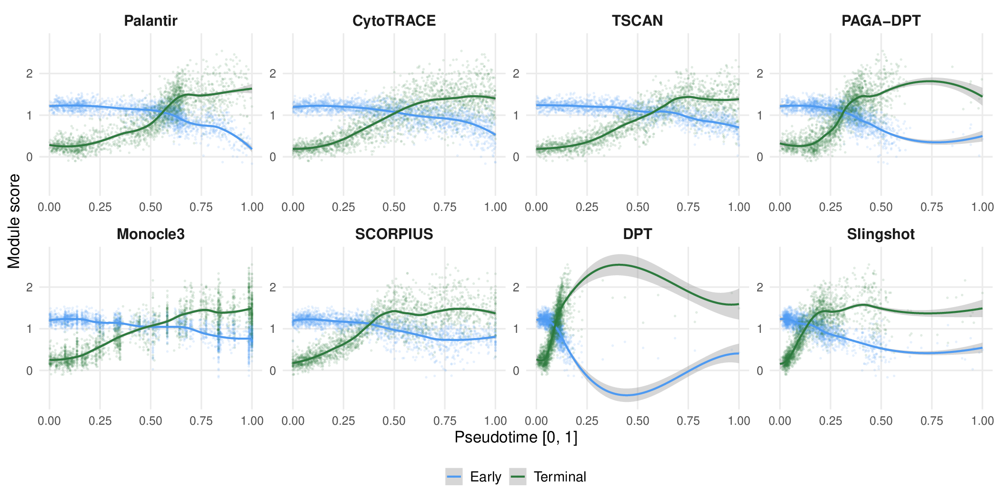
```

## 10. Do the underlying genes actually behave as expected?

Module scores summarize many genes at once; it's worth checking a handful of
named marker genes directly. Here, naive-associated transcription factors
(`TCF7`, `LEF1`, `FOXP1`) should fall and exhaustion-associated ones (`TOX`,
`BATF`, `EOMES`) should rise across pseudotime — fit with a GAM rather than a
straight line, since the real relationship usually isn't linear:

```{r gam-tf-trends, eval = FALSE}
naive_tfs <- c("TCF7", "LEF1", "FOXP1")
tex_tfs   <- c("TOX", "BATF", "EOMES")

gam_df <- do.call(rbind, lapply(method_order, function(m) {
  pt <- pseudotime_methods[[m]]
  do.call(rbind, lapply(c(naive_tfs, tex_tfs), function(g) {
    data.frame(Method = m, Gene = g, Pseudotime = pt,
               Expr = expr[g, ],
               GeneGroup = if (g %in% naive_tfs) "Early" else "Terminal")
  }))
}))
gam_df$Method <- factor(gam_df$Method, levels = method_order)

ggplot2::ggplot(gam_df, ggplot2::aes(Pseudotime, Expr)) +
  ggplot2::geom_point(size = 0.15, alpha = 0.08, colour = "grey50") +
  ggplot2::geom_smooth(ggplot2::aes(colour = GeneGroup, fill = GeneGroup),
                       method = "gam", formula = y ~ s(x, bs = "cs")) +
  ggplot2::facet_grid(Method ~ GeneGroup + Gene, scales = "free_y") +
  ggplot2::theme_minimal()
```

```{r s9-gam-trends, echo = FALSE, eval = TRUE, out.width = "100%"}
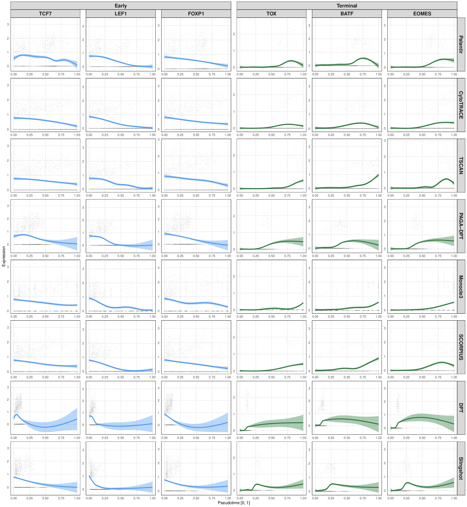
```

## 11. Pseudotime vs. known cell type, per method

Finally, since `functional.cluster` gives an independent (pseudotime-free)
ordering of cell state (NaiveLike → CM → EM → TPEX → TEX), a good method's
pseudotime distribution should increase monotonically across those clusters.
Each panel below is annotated with its DOE score for reference:

```{r violin-celltype, eval = FALSE}
violin_df <- do.call(rbind, lapply(method_order, function(m) {
  data.frame(Method = m, CellType = cd8t$functional.cluster,
             Pseudotime = pseudotime_methods[[m]])
}))
violin_df$Method <- factor(violin_df$Method, levels = method_order)

ggplot2::ggplot(violin_df, ggplot2::aes(CellType, Pseudotime)) +
  ggplot2::geom_violin(ggplot2::aes(fill = CellType), scale = "width") +
  ggplot2::geom_boxplot(width = 0.15, outlier.size = 0.4) +
  ggplot2::facet_wrap(~ Method, ncol = 4) +
  ggplot2::theme_classic()
```

```{r s9-violin, echo = FALSE, eval = TRUE, out.width = "100%"}
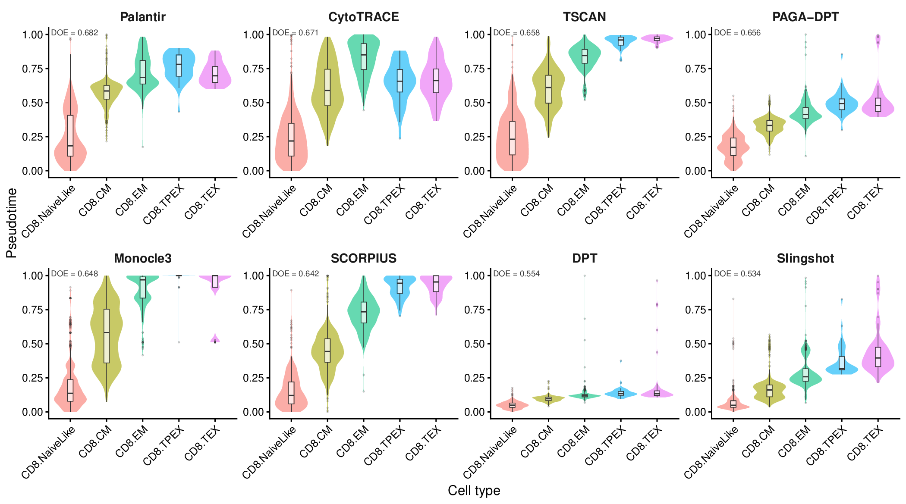
```

## 12. Using DOE to sanity-check a root cell choice

Several TI methods (Monocle3 among them) require you to pick a root cell —
and a wrong root silently produces a plausible-looking but biologically
backwards trajectory. BioTrajX's DOE score can be used to check that choice
*before* trusting the result: run the same method from several candidate
roots and compare their DOE scores.

Below, Monocle3 is run independently from 7 candidate root cells: three
different heuristics for locating the naive-like population (a CytoTRACE
"most primitive" cell, the PCA centroid of the `CD8.NaiveLike` cluster, and
the cell with the highest naive-marker module score), plus one PCA-centroid
cell from each of the other four clusters (as deliberately wrong roots):

```{r root-robustness, eval = FALSE}
pca <- Embeddings(cd8t, "pca")[, 1:20]

centroid_cell <- function(cluster_name) {
  idx <- which(cd8t$functional.cluster == cluster_name)
  ctr <- colMeans(pca[idx, , drop = FALSE])
  d   <- rowSums(sweep(pca[idx, , drop = FALSE], 2, ctr)^2)
  colnames(cd8t)[idx[which.min(d)]]
}

roots <- c(
  "NaiveLike (CytoTRACE)"     = names(which.min(run_cytotrace(expr, expr))),
  "NaiveLike (centroid)"      = centroid_cell("CD8.NaiveLike"),
  "NaiveLike (naive markers)" = names(which.max(cd8t$early_mod1)),
  "CD8.CM"   = centroid_cell("CD8.CM"),
  "CD8.EM"   = centroid_cell("CD8.EM"),
  "CD8.TPEX" = centroid_cell("CD8.TPEX"),
  "CD8.TEX"  = centroid_cell("CD8.TEX")
)

pt_by_root <- lapply(roots, function(root) run_monocle3(expr, start_cell = root))

res_by_root <- compute_multi_doe_linear(
  expr,
  pseudotime_list  = pt_by_root,
  early_markers    = early,
  terminal_markers = term
)

plot(res_by_root, type = "bar")
```

The three naive-like roots score clearly higher than the four wrong-cluster
roots — DOE flags the biologically implausible starting points without ever
being told which root was "correct":

```{r s11-root-robustness, echo = FALSE, eval = TRUE, out.width = "100%"}
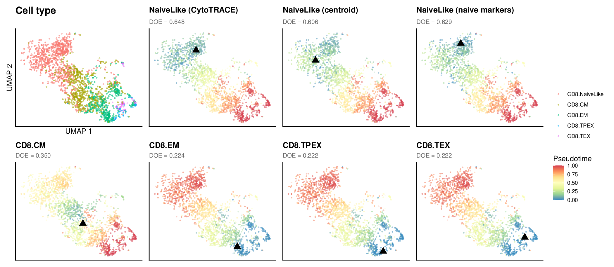
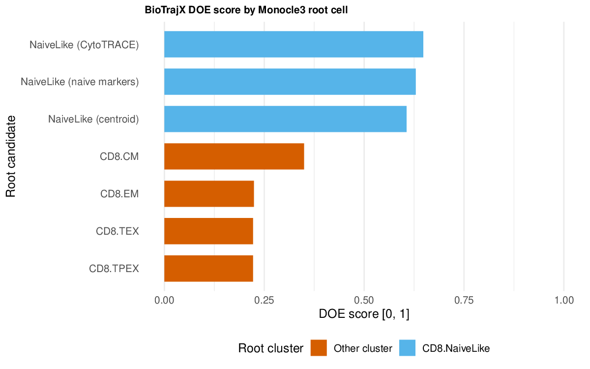
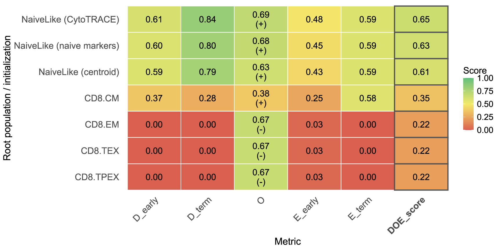
```
