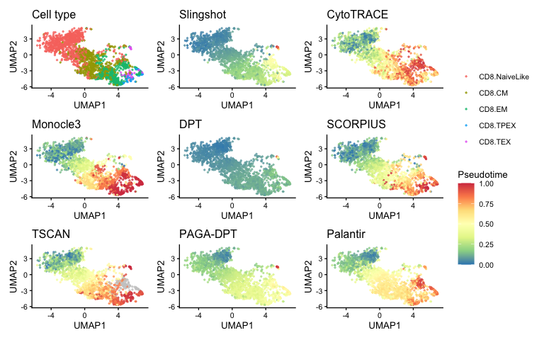
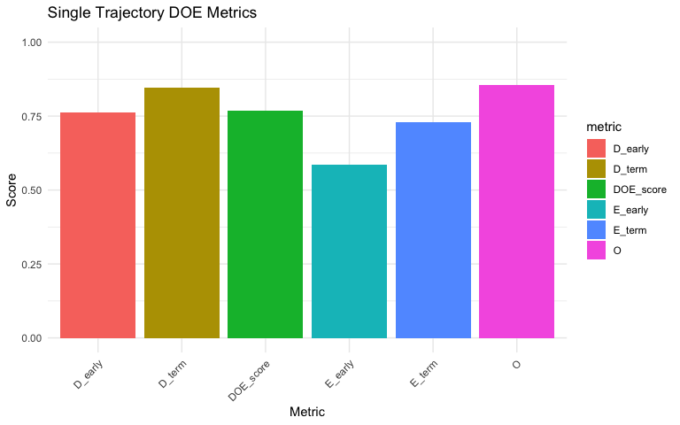
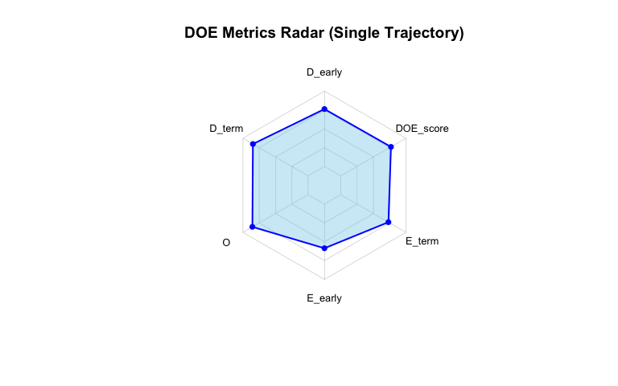
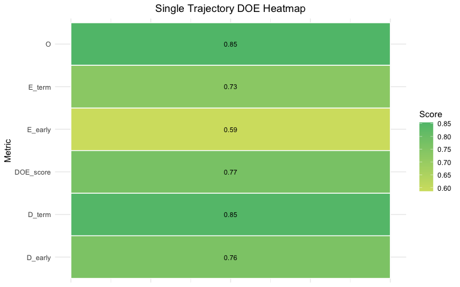
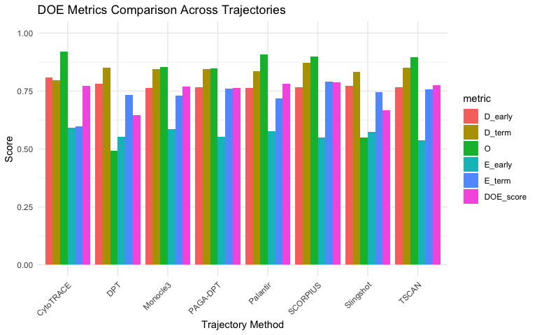
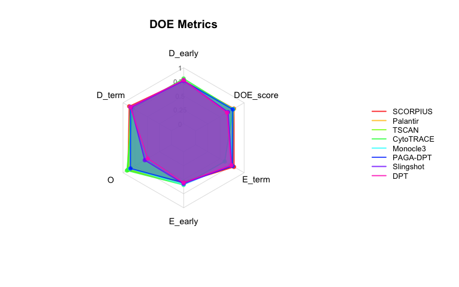
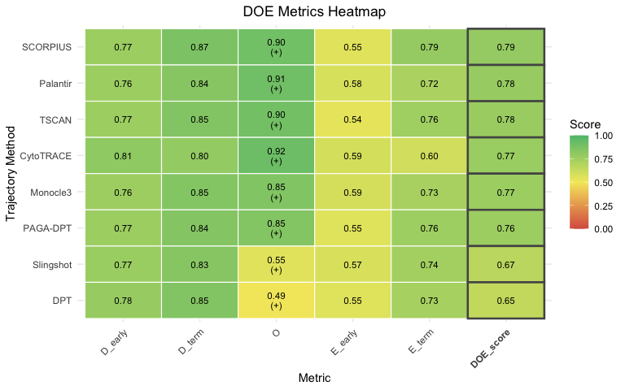

Evaluating Pseudotime Methods with BioTrajX (Linear Datasets)
================

This article walks through applying BioTrajX’s DOE metrics to a CD8⁺
T-cell exhaustion dataset: head and neck squamous cell carcinoma
tumor-infiltrating and peripheral-blood CD8⁺ T cells (GSE164690),
annotated with ProjecTILs into five functional states — `CD8.NaiveLike`,
`CD8.CM`, `CD8.EM`, `CD8.TPEX`, and `CD8.TEX` — that define the expected
naive-to-exhausted progression. The dataset ships with pseudotime from
eight trajectory inference (TI) methods already computed and stored as
`meta.data` columns, so this vignette starts directly from that
pre-computed Seurat object rather than re-running any TI method.

## 1. Load the data

``` r
library(BioTrajX)
library(Seurat)

cd8t <- readRDS("data/cd8t.rds")

# Order the five states naive-to-exhausted rather than alphabetically, so
# plots below read low-to-high along the trajectory.
cd8t$functional.cluster <- factor(
  cd8t$functional.cluster,
  levels = c("CD8.NaiveLike", "CD8.CM", "CD8.EM", "CD8.TPEX", "CD8.TEX")
)
cd8t
#> An object of class Seurat 
#> 33545 features across 1942 samples within 1 assay 
#> Active assay: RNA (33545 features, 2000 variable features)
#>  5 layers present: data, counts, scale.data.1, scale.data.2, scale.data
#>  2 dimensional reductions calculated: pca, umap
```

`cd8t$functional.cluster` holds the five ProjecTILs states, and
`cd8t@meta.data` already has one numeric column per TI method:
`Slingshot`, `CytoTRACE`, `Monocle3`, `DPT`, `SCORPIUS`, `TSCAN`,
`PAGA-DPT`, and `Palantir`.

## 2. Visualize labels and pseudotime

One UMAP panel for the ground-truth cell states, plus one panel per TI
method colored by that method’s pseudotime:

``` r
pt_cols <- c("Slingshot", "CytoTRACE", "Monocle3", "DPT",
             "SCORPIUS", "TSCAN", "PAGA-DPT", "Palantir")

umap_df <- as.data.frame(Embeddings(cd8t, "umap"))
colnames(umap_df) <- c("UMAP1", "UMAP2")
umap_df$CellType <- cd8t$functional.cluster[rownames(umap_df)]

p_celltype <- ggplot2::ggplot(umap_df, ggplot2::aes(UMAP1, UMAP2, colour = CellType)) +
  ggplot2::geom_point(size = 0.5, alpha = 0.7) +
  ggplot2::theme_classic(base_size = 10) +
  ggplot2::labs(title = "Cell type", colour = NULL)

method_plots <- lapply(pt_cols, function(method) {
  df <- cbind(umap_df[, c("UMAP1", "UMAP2")], Pseudotime = cd8t@meta.data[[method]])
  ggplot2::ggplot(df, ggplot2::aes(UMAP1, UMAP2, colour = Pseudotime)) +
    ggplot2::geom_point(size = 0.5, alpha = 0.7) +
    # Fixed limits (pseudotime is always on a [0, 1] scale here) so every
    # panel's colour scale is identical — that's what lets patchwork collapse
    # them into one shared legend instead of repeating it on every panel.
    ggplot2::scale_colour_distiller(palette = "Spectral", direction = -1,
                                     na.value = "grey80", limits = c(0, 1)) +
    ggplot2::theme_classic(base_size = 10) +
    ggplot2::labs(title = method)
})

if (requireNamespace("patchwork", quietly = TRUE)) {
  patchwork::wrap_plots(c(list(p_celltype), method_plots), ncol = 3) +
    patchwork::plot_layout(guides = "collect") &
    ggplot2::theme(legend.position = "right")
} else {
  p_celltype
  method_plots
}
```

<!-- -->

## 3. Marker genes

BioTrajX scores D and E using an “early” marker set (expected high in
naive cells) and a “terminal” marker set (expected high in exhausted
cells). This vignette uses the same curated signatures as the manuscript
— the `CD8+ Tn` (naive) and `CD8+ GZMK+ Tex` (exhausted) panels from the
pan-cancer T-cell atlas shipped by the
[SlimR](https://github.com/zhaoqing-wang/SlimR) package. SlimR is not a
BioTrajX dependency, so install it separately first:

``` r
install.packages("SlimR")
```

``` r
pctit <- SlimR::Markers_list_PCTIT

# filter_markers() dispatches on class "marker_set" — tag the SlimR lists as
# one so they get the same detection-rate filtering get_markers_*() output does.
ms <- structure(
  list(early    = pctit[["CD8+ Tn"]]$Markers,
       terminal = pctit[["CD8+ GZMK+ Tex"]]$Markers,
       source   = "SlimR_PCTIT",
       metadata = list()),
  class = "marker_set"
)

filtered <- filter_markers(ms, cd8t, top_n = NULL, min_detection = 0.10)
early_markers    <- filtered$early
terminal_markers <- filtered$terminal
```

`get_markers_msigdb()` and `get_markers_cellmarker()` are available as
alternative, database-backed sources of early/terminal marker genes if
you’d rather not depend on SlimR.

## 4. Evaluate a single pseudotime trajectory

With markers in hand, `compute_single_doe_linear()` scores one
pseudotime vector against the three DOE components — Directionality,
Order, and Endpoints:

``` r
res_single <- compute_single_doe_linear(
  expr_or_seurat   = cd8t,
  pseudotime       = cd8t$Monocle3,
  early_markers    = early_markers,
  terminal_markers = terminal_markers,
  cluster_labels   = "functional.cluster",
  E_method         = "gmm"
)

res_single$DOE_score
#> [1] 0.7697032
plot(res_single, type = "bar")
```

<!-- -->

``` r
plot(res_single, type = "radar")
```

<!-- -->

``` r
plot(res_single, type = "heatmap")
```

<!-- -->

## 5. Compare all eight methods at once

`compute_multi_doe_linear()` runs the same evaluation across every
method in one call and ranks them. Pseudotime vectors are passed as a
named list; methods with too few non-missing values (here, `TSCAN` has
some `NA`s) are dropped first.

``` r
pt_list <- setNames(lapply(pt_cols, function(col) cd8t@meta.data[[col]]), pt_cols)
pt_list <- pt_list[sapply(pt_list, function(x) sum(!is.na(x)) > 10)]

res <- compute_multi_doe_linear(
  expr_or_seurat   = cd8t,
  pseudotime_list  = pt_list,
  early_markers    = early_markers,
  terminal_markers = terminal_markers,
  cluster_labels   = "functional.cluster",
  E_method         = "gmm"
)
#> Computing DOE metrics for 8 trajectories...
#> ==========================================================
#> 
#> --- Processing trajectory: Slingshot ---
#> 
#> --- Processing trajectory: CytoTRACE ---
#> 
#> --- Processing trajectory: Monocle3 ---
#> 
#> --- Processing trajectory: DPT ---
#> 
#> --- Processing trajectory: SCORPIUS ---
#> 
#> --- Processing trajectory: TSCAN ---
#> 
#> --- Processing trajectory: PAGA-DPT ---
#> 
#> --- Processing trajectory: Palantir ---
#> 
#> ==========================================================
#> Multi-trajectory DOE analysis complete!
#> Best trajectory: SCORPIUS (DOE score: 0.789)

res$comparison_summary
#>   trajectory   D_early    D_term    D_comp         O O_orientation   E_early
#> 1   SCORPIUS 0.7680069 0.8713326 0.8196698 0.8979655             + 0.5493827
#> 2   Palantir 0.7647302 0.8356365 0.8001833 0.9076004             + 0.5781893
#> 3      TSCAN 0.7651012 0.8498823 0.8074917 0.8952219             + 0.5367483
#> 4  CytoTRACE 0.8072178 0.7958930 0.8015554 0.9192523             + 0.5925926
#> 5   Monocle3 0.7623016 0.8462281 0.8042648 0.8542853             + 0.5864198
#> 6   PAGA-DPT 0.7679280 0.8445120 0.8062200 0.8468488             + 0.5534979
#> 7  Slingshot 0.7724571 0.8329140 0.8026855 0.5507964             + 0.5740741
#> 8        DPT 0.7826816 0.8499346 0.8163081 0.4920760             + 0.5534979
#>      E_term    E_comp DOE_score has_error D_early_rank D_term_rank D_comp_rank
#> 1 0.7901235 0.6481197 0.7885850     FALSE            4           1           1
#> 2 0.7181070 0.6405970 0.7827936     FALSE            7           6           8
#> 3 0.7572383 0.6282080 0.7769739     FALSE            6           3           3
#> 4 0.5987654 0.5956630 0.7721569     FALSE            1           8           7
#> 5 0.7304527 0.6505594 0.7697032     FALSE            8           4           5
#> 6 0.7613169 0.6409835 0.7646841     FALSE            5           5           4
#> 7 0.7448560 0.6484082 0.6672967     FALSE            3           7           6
#> 8 0.7345679 0.6313060 0.6465634     FALSE            2           2           2
#>   O_rank E_early_rank E_term_rank E_comp_rank DOE_score_rank
#> 1      3            7           1           3              1
#> 2      2            3           7           5              2
#> 3      4            8           3           7              3
#> 4      1            1           8           8              4
#> 5      5            2           6           1              5
#> 6      6            5           2           4              6
#> 7      7            4           4           2              7
#> 8      8            5           5           6              8
res$best_trajectory
#> [1] "SCORPIUS"
plot(res, type = "bar")
```

<!-- -->

``` r
plot(res, type = "radar")
```

<!-- -->

``` r
plot(res, type = "heatmap")
```

<!-- -->

## 6. Would biologically implausible root gives a low DOE score?

A pseudotime trajectory rooted at the wrong starting cell runs
“backwards” relative to the true biology. To check whether DOE catches
that, we re-run Monocle3 from two different root cells — the
`CD8.NaiveLike` centroid (the biologically correct start) and the
`CD8.TEX` centroid (the wrong end of the trajectory) — and store both as
new `meta.data` columns alongside the eight pre-computed methods. This
needs `monocle3` and `SingleCellExperiment`, neither of which is a
BioTrajX dependency:

``` r
if (!requireNamespace("BiocManager", quietly = TRUE)) install.packages("BiocManager")
BiocManager::install("SingleCellExperiment")

# monocle3 is distributed from GitHub, not CRAN/Bioconductor
BiocManager::install(c("BiocGenerics", "DelayedArray", "DelayedMatrixStats", "limma",
                        "lme4", "S4Vectors", "SummarizedExperiment", "batchelor",
                        "HDF5Array", "terra", "ggrastr"))
if (!requireNamespace("devtools", quietly = TRUE)) install.packages("devtools")
devtools::install_github("cole-trapnell-lab/monocle3")
```

If `install_github()` fails with something like
`namespace 'rlang' ... is already loaded, but >= ... is required`,
restart R first — an old `rlang` already loaded in your session can’t be
swapped out mid-session. After restarting, run
`install.packages("rlang")` *before* loading any other package, then
retry the `monocle3` install.

``` r
# Monocle3 is run on the top 2000 highly-variable genes, not the full gene
# set — this matches standard practice and is what the manuscript's own
# root-robustness analysis uses.
cd8t <- FindVariableFeatures(cd8t, nfeatures = 2000, verbose = FALSE)
hvg  <- VariableFeatures(cd8t)

centroid_cell <- function(obj, cluster, label_col = "functional.cluster", n_pcs = 20) {
  pca   <- Embeddings(obj, "pca")[, 1:n_pcs]
  idx   <- which(obj@meta.data[[label_col]] == cluster)
  ctr   <- colMeans(pca[idx, , drop = FALSE])
  dists <- rowSums(sweep(pca[idx, , drop = FALSE], 2, ctr)^2)
  colnames(obj)[idx[which.min(dists)]]
}

root_naive <- centroid_cell(cd8t, "CD8.NaiveLike")
root_tex   <- centroid_cell(cd8t, "CD8.TEX")

run_monocle3_from_root <- function(seurat, start_cell, genes) {
  expr <- as.matrix(GetAssayData(seurat, assay = "RNA", layer = "data"))[genes, ]
  cds  <- monocle3::new_cell_data_set(
    Matrix::Matrix(expr, sparse = TRUE),
    cell_metadata = data.frame(cell_id = colnames(expr), row.names = colnames(expr)),
    gene_metadata = data.frame(gene_short_name = rownames(expr), row.names = rownames(expr))
  )
  cds <- monocle3::preprocess_cds(cds, num_dim = min(30L, ncol(expr) - 1L))
  cds <- monocle3::reduce_dimension(cds, reduction_method = "UMAP")
  cds <- monocle3::cluster_cells(cds)
  cds <- monocle3::learn_graph(cds, use_partition = FALSE)
  cds <- monocle3::order_cells(cds, root_cells = start_cell)

  pt <- monocle3::pseudotime(cds)
  pt[is.infinite(pt)] <- NA_real_
  rng <- range(pt, na.rm = TRUE)
  (pt - rng[1]) / (rng[2] - rng[1])
}

pt_root_naive <- run_monocle3_from_root(cd8t, root_naive, hvg)
#>   |                                                                              |                                                                      |   0%  |                                                                              |======================================================================| 100%
pt_root_tex   <- run_monocle3_from_root(cd8t, root_tex, hvg)
#>   |                                                                              |                                                                      |   0%  |                                                                              |======================================================================| 100%

cd8t <- AddMetaData(cd8t, pt_root_naive[colnames(cd8t)], col.name = "Monocle3_root_naive")
cd8t <- AddMetaData(cd8t, pt_root_tex[colnames(cd8t)],   col.name = "Monocle3_root_tex")
```

``` r
res_root_naive <- compute_single_doe_linear(
  expr_or_seurat = cd8t, pseudotime = cd8t$Monocle3_root_naive,
  early_markers = early_markers, terminal_markers = terminal_markers,
  cluster_labels = "functional.cluster", E_method = "gmm"
)
res_root_tex <- compute_single_doe_linear(
  expr_or_seurat = cd8t, pseudotime = cd8t$Monocle3_root_tex,
  early_markers = early_markers, terminal_markers = terminal_markers,
  cluster_labels = "functional.cluster", E_method = "gmm"
)

data.frame(
  root      = c("CD8.NaiveLike centroid", "CD8.TEX centroid"),
  DOE_score = c(res_root_naive$DOE_score, res_root_tex$DOE_score)
)
#>                     root DOE_score
#> 1 CD8.NaiveLike centroid 0.7307730
#> 2       CD8.TEX centroid 0.2755454
```

Rooting Monocle3 at the exhausted end rather than the naive end lowers
the DOE score substantially — the same signal that would flag a
genuinely mis-rooted TI run on real data.
